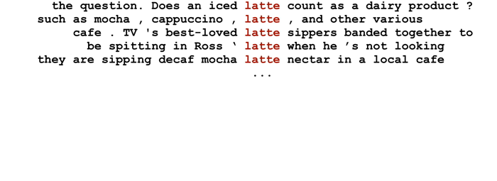
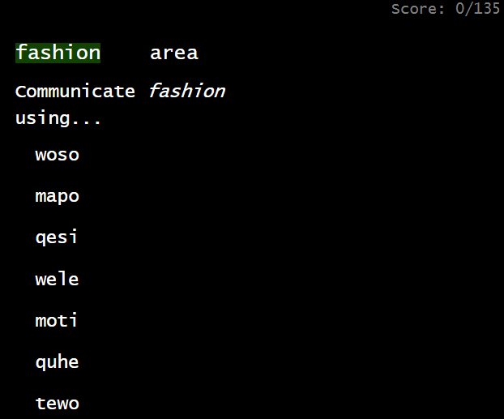
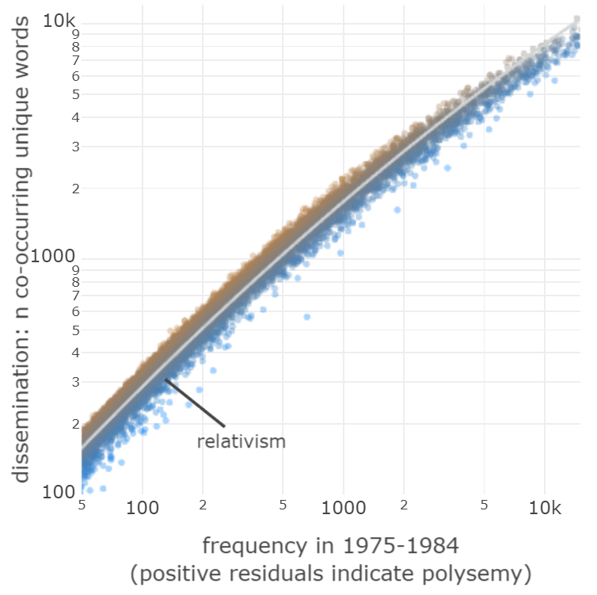

class: inverse
# Communicative need and language change

<style>
.remark-slide-content {
  padding-top: 7px;
  padding-left: 25px;
  padding-right: 20px;
  padding-bottom: 30px;
}
body { 
  line-height: 3em;
} 
.mjx-chtml{ font-size: 100% !important; } 
.small { font-size: 50%; margin-top:0em; margin-bottom:0em; line-height:0px;}
.mono {font-family: monospace, monospace; font-size: 80%;}

p {margin-bottom:0em; margin-top:0em}
li {margin-bottom:0.5em }

.noborder {
  padding-top: 7px;
  padding-left: px;
  padding-right: 3px;
  padding-bottom: 5px;
}

</style>


```{r setup, echo=F}
options(htmltools.dir.version = FALSE)
options(servr.daemon = TRUE)
knitr::opts_chunk$set(results = 'asis', echo = FALSE, comment = FALSE,  warning = FALSE, message = FALSE, fig.align = 'left', fig.height=5, out.width='100%', eval=T, dpi=300)
options(scipen=999)
```

```{r}
#library(plotly, quietly = T)
library(magrittr)
library(ggplot2)
library(patchwork)
load("C:/Users/s1364178/Dropbox/phd/lexical_competition/talks/cletalk2020/colexplots.RData")
```

```{r xaringan-themer, include = FALSE}
# devtools::install_github("gadenbuie/xaringanthemer")
library(xaringan)
library(xaringanthemer)
mono_light(
  base_color = rgb(0,0,0.2),
  black_color = "black",
  background_color = "white",
  header_font_google = google_font("Nanum Gothic"),
  text_font_google   = google_font("Nanum Gothic", "300", "300i"),
  text_slide_number_font_size = "0.4em",
  header_h1_font_size = "50px",
  text_font_size = "35px",
  text_font_family_fallback = "Helvetica",
  code_font_google   = google_font("Droid Mono"),
  title_slide_background_image = "img/cle.png",
  title_slide_background_size = "8%",
  title_slide_background_position = "top right",
  link_color = "darkblue",
  extra_css = list(".title-slide h1" = list("font-size" = "100px"))
)
```

```{r functions}
#knitr::knit_exit() # titleslide debug handbrake

library(RColorBrewer)
library(dplyr)
library(plotly)

```


---
# Communicative need and language change

- Language change driven my a multitude of factors
--

- Also: communicative need, utility and adaption
.small[(Givon 1982, McMahon 1994:194, Tomasello 1999:37, Winters et al. 2015, Regier et al. 2016, Gibson et al. 2017, Smith et al. 2017)]
--

- Languages change because the speakers need them to change
--

- I will focus on words and the lexicosemantic space
- Two processes: lexical competition, colexification (or lack thereof)
- Corpus data + machine learning; experimental data


---
# Changing communicative need 

- Inferred using the topical advection model .small[(Karjus et al. 2020, Quantifying the dynamics of topical fluctuations in language)]
- Assumption: changes in topic frequencies approximately correspond to changes in communicative needs (what people want/need to talk about)
--

- For each target word:
 - generate a "topic" consisting of _m_ associated context words
 - take the (association-weighted) mean of the log frequency change in the context words

---

<br>



- For each target word:
 - generate a "topic" consisting of _m_ associated context words
 - take the (association-weighted) mean of the log frequency change in the context words


---
class:inverse

# Competition dynamics

---
class: noborder

<br>

```{r, fig.width=12,fig.height=5 , out.height=500,out.width=1200,eval=T}
slides_airplane + theme(plot.margin=grid::unit(c(0,0,0,0), "mm"))
```

---
# Competition dynamics

- As some words experience higher selection, what happens to their synonyms? (e.g. to the old word when a synonymous new word is coined or borrowed)
--

- Hypothesis 1: frequency increase in a word will lead to direct competition with (and possibly replacement of) near-synonym(s) **- unless** the lexical subspace experiences high communicative need. 

---

# Quantifying competition

- Data: sample unique words from a corpus (COHA), with frequency increase $\ln\geq 2$ between any 2 spans of 10y, occur in $\geq 2$ years, $\geq$ 100x
--

- Diachronic word embeddings, based on co-occurrence .small[(cf. Dubossarsky et al. 2019)]


---
# Quantifying competition

- Important: word occurrence probabilities sum up to 1; increase in x means decrease in y
- The measure: *how far* (in terms of cosine distance) the probability mass gets equalized, i.e., target increase $\geq \sum_{}^{}$ (neighbors' decreases).
- Indicates if the increasing target replaced semantically close word(s) (direct competition, obvious likely source of probability mass).

---


```{r examplespace, out.width="95%", fig.height=3, eval=T}
#expl

ex = data.frame(x={set.seed(1);rnorm(1000)}, y={set.seed(2);rnorm(1000)},change=rnorm(1000,sd=2.4) );ex$change[1]=10;ex$change[2]=-10; ex$change[200:1000] = rnorm(801, sd=0.2)
rownames(ex)=1:1000

e1 = ggplot(ex, aes(x,y, color=change)) + 
  annotate("line", x=ex[c(446, 656, 963),"x"], y=ex[c(446, 656, 963),"y"], color="gray") +
  geom_point(size=1.4, alpha=0.7) +
  geom_point(aes(x=ex[446,"x"], y=ex[446,"y"]), color=rgb(1,0,0), size=2.2) +
  geom_point(aes(x=ex[656,"x"], y=ex[656,"y"]), color="#2B2BF0", size=1.5) +
  geom_point(aes(x=ex[963,"x"], y=ex[963,"y"]), color="#8B8BCF", size=1.5)+
  theme_minimal(base_size = 10) + 
    theme(legend.position = "right") +
    scale_color_gradient2(low="blue", mid="lightgray", high="red") +
  labs(x="", y="") + theme(legend.position = "none")


e2 = ggplot(ex, aes(x,y, color=change)) + 
  annotate("line", x=ex[c(446, 656, 963),"x"], y=ex[c(446, 656, 963),"y"], color="black", size=1)+
  geom_point(size=4.4, alpha=0.7) +
  geom_point(aes(x=ex[446,"x"], y=ex[446,"y"]), color=rgb(1,0,0), size=9) +
  geom_point(aes(x=ex[656,"x"], y=ex[656,"y"]), color="#2B2BF0", size=4.6) +
  geom_point(aes(x=ex[963,"x"], y=ex[963,"y"]), color="#8B8BCF", size=4.6)+
  annotate("text", x=ex[c(446, 656, 963),"x"]+0.13, y=ex[c(446, 656, 963),"y"], label=c("+10", "-8", "-2"), color="black", size=3) +
  theme_minimal(base_size = 10) + 
    theme(legend.position = "right") +
    scale_color_gradient2(low="blue", mid="lightgray", high="red", name= "change\npmw") +
  labs(x="", y="") + lims(x=c(-3.2,-2.2), y=c(-0.5,0.4))

e1 + plot_spacer()

```

---

```{r examplespace2, out.width="95%", fig.height=3, eval=T}
e1 + e2
```

---
class: noborder

- Relies on these two (non-overlapping) word lists for each target:

```{r, fig.width=12,fig.height=5 , out.height=500,out.width=1200,eval=T}
s = slides_airplanemodel
# s[[2]]$layers[[7]]$aes_params$size = 4
# s[[2]]$layers[[8]]$aes_params$size = 4
s[[1]] = s[[1]] + theme(plot.margin=grid::unit(c(0,1,0,10), "mm"))
s[[2]] = s[[2]] + theme(plot.margin=grid::unit(c(0,1,0,0), "mm"))
s 

```


---
class: noborder
```{r, fig.width=7.9,fig.height=4.4,  eval=T}
slides_results1 + theme(plot.margin=grid::unit(c(0,4,0,0), "mm"))

# 
```


---
# Results (COHA)

- $R^2=0.16, p<0.001$, if communicative need is lower, then competition signal is clearer
- Also controlled for, but all $p>0.05$: distance to nearest word &#8226; change magnitude &#8226; series burstiness &#8226; semantic subspace instability &#8226; uniqueness of the form &#8226; smallest edit distance among closest sem neighbors &#8226; polsemy &#8226; leftover prob. mass &#8226; age of word in corpus &#8226; target decade.
- Similar results on corpora of German, Estonian and Scottish Twitter

---
background-image: url(img/tweets.png) 
background-size: cover

# Work in progress: Scottish Twitter

- 316 days; per day: ~50k users, <br> ~170k unique tweets,<br>~1.6m words/day (after cleaning)


---
class: inverse

# Colexification

---

# Colexification: corpus evidence

- Semantic space density is not uniform. Some meanings are lexified by individual words while others are colexified (e.g. 'hand', 'arm' as single word) .small[(François 2008)]
- Similar meanings more likely but "...communicative needs may intervene such that strongly related ideas such as "sister" and "brother" ... may benefit from being distinguished with separate lexemes" .small[(Xu et al. to appear; Kemp & Regier, 2012)]
--

- Hypothesis 2.1: changes in lexical density are not random; some variance is explained by changes in communicative need.


---

# Colexification: corpus evidence

- Approach: train word embeddings on period subcorpora (sliding window), scan for denser-than-expected subspaces 
- word clusters at a proximity where in 95% cases there would be no more than 1 word

```{r, out.width="95%", fig.height=2, eval=T}
x={rnorm(10000,0.72,0.08) %>% subset(.<1)}
q = sort(x)[0.95*length(x)]

ggplot(data.frame(x),aes(y=x, x=1)) + 
  geom_violin(color="lightgray", fill="lightgray") +
  geom_boxplot(fill="lightgray", color="darkgray", outlier.color = "darkgray", width=0.6,outlier.size = 0.2) +
  geom_hline(yintercept = q, size=2)+
  ylim(0.25,1) + ylab("Cosine similarity of nearest neighbour") + 
 # labs(subtitle = "Nearest neighbor in the semantic space; entire lexicon") +
  annotate("text", x=1.5, y=0.83, label="95% of the words", hjust=1) +
  annotate("text", x=1.5, y=q+0.01, label="5% of the words", hjust=0) +
  annotate("text", x=0.5, y=0.83, label=paste0("Colexification threshold = ", round(q,2),"  ->"), hjust=1, fontface="bold") +
  theme_minimal() +
  theme(legend.position = "none", 
               panel.border = element_rect(color="darkgray",fill=NA), 
               axis.ticks = element_line(color="darkgray"), 
               strip.background = element_blank(),
               axis.text.x = element_text()
               #strip.text = element_blank(),
         )  +
         theme(#panel.grid.major.x = element_blank(),
               panel.grid.minor.y = element_blank(),
                panel.grid.minor.x = element_blank(),
               panel.grid.major.y = element_blank(),
               axis.text.y=element_blank(),
               axis.title.y=element_blank(),
               axis.ticks.y =element_blank()
         )  +
         theme(
            panel.border = element_rect(color="darkgray",fill=NA), 
            axis.ticks = element_line(color="darkgray"), 
            strip.background = element_blank(),
            strip.text = element_text(hjust=0, size = 13)
            #strip.text = element_blank(),
         ) +coord_flip() 

```


---

# Colexification: corpus evidence

- Mostly reasonable results, but the distributional semantics approach at times conflates similarity relations other than synonymy.
- (*instalment, installment*), (*birth control, contraception*), (*amazement,    astonishment*), (*bourbon, gin, scotch*)
--

- But also (*east, west*), (*tennis, golf*), (*constitution, constitutional*)


---

# Colexification: corpus evidence

- 20y spans; two ways of analysing change in local semantic subspace density
- "lookback": upon finding cluster, look into the past of that subspace
--

- "lookahead": upon finding cluster, see what happens to it in the future.
--

- Correlate with the mean advection value of the target words (excluding cluster members from topic list)
- Requires complex parametrization; see Appendix.


---
class: noborder
```{r, fig.width=12,fig.height=6 , out.height=600,out.width=1200,eval=T}
s=slides_colexplot
s[[1]] = s[[1]] + theme(plot.margin=grid::unit(c(0,5,0,5), "mm"))
s[[2]] = s[[2]] + theme(plot.margin=grid::unit(c(0,5,0,5), "mm"))
l="
AAAB
CCCC
"
s[[1]] + plot_spacer() + plot_spacer() +  plot_layout(design = l)
```

---
class: noborder

```{r, fig.width=12,fig.height=6 , out.height=600,out.width=1200,eval=T}

l="
AABB
##BB
"
s[[1]] + s[[2]] +  plot_layout(design = l)
```

---
class: noborder

```{r, fig.width=12,fig.height=6 , out.height=600, out.width=1200,eval=T}
slides_beedemo
```
.small[Ordinal regression; McFadden's R^2; kappa = baseline-adjusted accuracy (10-fold CV). Improvement over reduced model in brackets.]

---
class: noborder
```{r, fig.width=12,fig.height=6 , out.height=600, out.width=1200,eval=T}
slides_beesplot
```
.small[Ordinal regression; McFadden's R^2; kappa = baseline-adjusted accuracy (10-fold CV). Improvement over reduced model in brackets.]

---
class: inverse

# Colexification: experimental approach 

(work in progress)

---

# Colexification: experimental approach 

- Hypothesis 2.2: given limited lexical resources, speakers are more likely to colexify similar meanings **- unless** blocked by increased need to distinguish the similar meanings
--

- Artificial language coordination game, in dyads .small[(cf. Winters et al. 2015)]
- Signal space: 7, meaning space: 10 - so something has to be colexified!
--

- Meanings: English nouns from Simlex999 similarity judgements .small[(Hill et al. 2015)], controlling for formal similarity, free association score
- Artificial language: CVCV words; control for dissimilarity within the set and to any English words

---
class:inverse

- 135 rounds (only communication; first 1/3 considered "burn-in"), take turns sending a message/signal and guessing the meaning.



---

# Colexification: experimental approach 

- Each meaning set has 3 near-synonymous target pairs (e.g. *rain, drizzle*)
- Baseline condition: uniform distribution of pairs shown; expectation: similar meanings will be colexified
--

- Target condition: similar-meaning pairs more frequent (but frequency of shown meanings is uniform); expectation: the opposite
--

- Work in progress! So far only pilot results.

---
class: noborder

<br>
.small[Values in cells = n times a meaning was lexified by the artificial word]

```{r, fig.width=12,fig.height=5, out.height=500, out.width=1200,eval=T}
s = slides_pilotplot
s[[1]] = s[[1]] + theme(axis.text.y = element_text(size=12))
s[[2]] = s[[2]] + theme(axis.text.y = element_text(size=12))
s[[1]] + plot_spacer() + plot_spacer()
```
---
class: noborder

<br>
.small[Values in cells = n times a meaning was lexified by the artificial word]

```{r, fig.width=12,fig.height=5, out.height=500, out.width=1200,eval=T}
s[[1]] + s[[2]] + plot_spacer()
```

---
class: noborder

<br>
.small[Values in cells = n times a meaning was lexified by the artificial word]

```{r, fig.width=12,fig.height=5, out.height=500, out.width=1200,eval=T}
s
```

---
class: inverse

# Conclusions

---
class: inverse

# Conclusions

- Communicative need describes a small amount of variance in competitive interactions between words in diachronic corpora
--

- And, a small amount of variance in colexification dynamics (particularly in increase of lexical density)
--

- Real effect could be bigger? (messy population aggregates; messy ML; *lots* of parameters)

- Next/ongoing step: colexification on the level of the individual.

--
- Slides: andreskarjus.github.io/cletalk2020 &#8226; more details on experiment & stimuli generator: akarjus.shinyapps.io/colexdemo

---
class: inverse


---
class: inverse
# Appendix

---
# All the parameters

<div style="font-size:16pt; line-height:25px">

- Preprocessing choices (lemmatized; removed stopwords, numbers; homogenized compounds, spelling) <br>
- COHA-based models now also incorporate a light multiword unit homogenization procedure, as English is often inconsistent in its spelling of these, and treating them as separate words is often misleading. As a first pass, multiword units over time are detected using PPMI scores, and then concatenated (essentially treated as compounds) before parsing&cleaning the corpus the second time. This appears to (as expected) slightly improve the descriptive power of the model.
- Competition model:
- LSA word embeddings: timespan (10y), min change (log()>2), min frequency in t2 (100), min occurrence years (8/10); <br>
- LSA k (100 dim), min freq (100), context window size (5), weighted <br>
- cosine distance: normalized by 1st neighbour <br>
- form similarity (restricted Damerau-Levenshtein, length-normalized) <br>
- Advection topic model: ppmi-based, m=75 words, min freq (100), context window size (10), weighted <br>
- Polysemy model: context window size (2), weighted <br>
- Colexification model: 
- colexification threshold = cosine distance at 95% quantile, mean of two subcorpora under comparison; 
- timespan (20y), sliding window of 5y for models; min occurrence in years (15/20); but also filtered out clusters where change comes from being just under the minimal frequency threshold; series peak detection min sd (20); filtered out clusters where change stems from semantic space movements within the threshold distance (presumably noise). 
- in case of overlap of words in clusters in the sliding window, kept the cluster with the most members, breaking ties by intra-cluster similarity; also why on the plots lookback has no negative changes and lookahead only has negative changes.

</div>


---
# Notes on the competition measure 

<div style="font-size:14pt; line-height:25px">

- We made sure to avoid auto-correlation between the advection measure and the dependent variable by filtering the neighbour lists of each target so that no topic word of the target (i.e. those with a PPMI>0 with the target, which are used to calculate the advection value) would be accounted for as a neighbor. This also makes sense from a semantic point of view: if two words, even if very similar occur near each other (e.g., "salt and pepper"), then it's less palusible that they would be competing against one another. Exceptions are certainly possible, such as meta-linguistic descriptions (e.g., "vapor, previously spelled as vapour"), but we assume these would be rare.<br>
- We also filtered out a small subset of target words with a leftover probability mass >100% of its frequency. We previously filtered out words with considerably higher-than-expected lexical dissemination (a proxy to polysemy, cf. Stewart & Eisenstein 2018), but that seems to make little difference, so not it's just a control variable in the model.<br>
- We did not make use of the entire Corpus of Historical American English, as most of the 19th century decades are less balanced and smaller in size, the imbalance extends to the occurrence of non-standard dialects or registers in occasional year subcorpora. Similarly, we only used years after 1800 in the German corpus. The Estonian corpus only spans two decades, 1990s and 2000s, so all comparisons were done between these two, without accounting for exact starting years of each word's increase.<br>
- This approach certainly has limitations stemming from the imperfect nature of corpus tagging, composition balance, and word-based vector semantics (here LSA). We also disregard issues such as homonymy (although we control for polysemy in the targets). The word-vector-based approach however allows for straighforwad comparison between time periods/temporal subcorpora.<br>
- We ran randomized baselines to make sure the observed correlation with advection is not some (unknown) artefact of the machine learning models used here. This was done by randomizing similarity matrices, i.e. each target was assigned a random list of neighbors, with random similarity values (drawn from the concatenation of all similarity vectors). After hundreds of iterations, the advection variable would come out with a p-value below 0.05 in only about 5% of the runs (i.e., as expected with an $\alpha=0.05$).<br>

</div>

---
# The polysemy measure

```{r, fig.height=5, out.width="50%", eval=F}
displot
```


---
# References

<div style="font-size:10pt; line-height:20px">
Karjus, A., Blythe, R.A., Kirby, S., Smith, K., 2020. Quantifying the dynamics of topical fluctuations in language. Language Dynamics and Change<br>
François, A., 2008. Semantic maps and the typology of colexification: Intertwining polysemous networks across languages, in: Vanhove, M. (Ed.), Studies in Language Companion Series. John Benjamins Publishing Company, Amsterdam, pp. 163–215. <br>
Gibson, E., Futrell, R., Jara-Ettinger, J., Mahowald, K., Bergen, L., Ratnasingam, S., Gibson, M., Piantadosi, S.T., Conway, B.R., 2017. Color naming across languages reflects color use. Proceedings of the National Academy of Sciences. <br>
Hamilton, W.L., Leskovec, J., Jurafsky, D., 2016. Diachronic Word Embeddings Reveal Statistical Laws of Semantic Change, in: Proceedings of the 54th Annual Meeting of the Association for Computational Linguistics, ACL 2016, August 7-12, 2016, Berlin, Germany, Volume 1: Long Papers.<br>
Xu, Y., Kemp, C., 2015. A Computational Evaluation of Two Laws of Semantic Change., in: CogSci.<br>
Xu, Y., Duong, K., Malt, B.C., Jiang, S., and Srinivasan, M. (to appear) Conceptual relations predict colexification across languages. Cognition.<br>
Petersen, A.M., Tenenbaum, J., Havlin, S., Stanley, H.E., 2012. Statistical Laws Governing Fluctuations in Word Use from Word Birth to Word Death. Scientific Reports 2.<br>
Regier, T., Carstensen, A., Kemp, C., 2016. Languages Support Efficient Communication about the Environment: Words for Snow Revisited. PLOS ONE 11, 1–17.<br>
Stewart, I., Eisenstein, J., 2018. Making “fetch” happen: The influence of social and linguistic context on nonstandard word growth and decline, in: Proceedings of the 2018 Conference on Empirical Methods in Natural Language Processing. Association for Computational Linguistics, Brussels, Belgium, pp. 4360–4370.<br>
Turney P.D., Mohammad S.M., 2019 The natural selection of words: Finding the features of fitness. PLOS ONE 14(1): e0211512.
</div>
