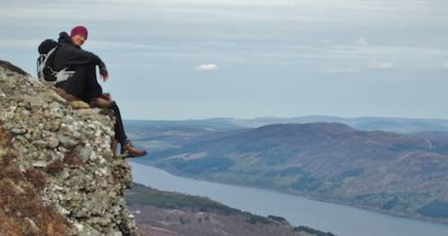

# Short academic bio

 
I am a PhD student in linguistics based at the [Centre for Language Evolution at the University of Edinburgh](http://www.lel.ed.ac.uk/cle/), working on evolutionary variant selection in language with [Kenny Smith](http://www.lel.ed.ac.uk/~kenny), [Simon Kirby](http://www.lel.ed.ac.uk/~simon) and [Richard A. Blythe](http://www2.ph.ed.ac.uk/~rblythe3/), utilizing massive corpora and natural language processing to hunt traces of selection and competition between elements of language. My research is supported by a Kristjan Jaak scholarship from the Archimedes Foundation of Estonia.

I am also affiliated with the University of Tartu as a (part-time) junior researcher in sociolinguistics at the [EKKAM](http://ekkam.ut.ee/en/) research group, specializing in data analysis and agent-based models.

Before coming to Edinburgh, I worked as a teaching assistant in informatics at the University of Tartu, before that studied artificial intelligence and natural language processing at KU Leuven (MSc) and linguistics at the University of Tartu (BA, MA). Somewhere in between I also did exchanges to the University of Iceland and the University Vienna, attended a dozen-odd academic summer schools, taught Icelandic to art students and Estonian to Norwegian teachers, worked as an assistant at the Estonian Wordnet project, and did internships at CrossLang NV in Belgium and at the (then still existing linguistics department of the) Max Planck Institute for Evolutionary Anthropology in Leipzig.

# Research

## Publications

* Andres Karjus, Richard A. Blythe, Simon Kirby, Kenny Smith, 2018. Topical advection as a baseline model for diachronic lexical dynamics. Proceedings of The Society for Computation in Linguistics. Volume 1. | [extended abstract, open access](http://scholarworks.umass.edu/scil/) [full paper in prep]
* Martin Ehala, Andres Karjus, [accepted]. Testing an agent based model of language choice on sociolinguistic survey data. Language Dynamics and Change.
*	Martin Haspelmath, Andres Karjus, 2017. Explaining asymmetries in number marking: Singulatives, pluratives and usage frequency. Linguistics, volume 55, issue 6. | [online version](https://www.degruyter.com/view/j/ling.2017.55.issue-6/ling-2017-0026/ling-2017-0026.xml)  | [preprint](https://www.academia.edu/25032500/Explaining_asymmetries_in_number_marking_Singulatives_pluratives_and_usage_frequency)
*	Andres Karjus, 2015. Through the Spyglass of Synchrony: Grammaticalization of the Exterior Space in the Eastern Circum-Baltic. In: Hilpert, Martin, Östman, Jan-Ola, Mertzlufft, Christine, Rießler, Michael, Duke, Janet (eds.), Advances in Nordic Linguistics. De Gruyter Mouton.
| [google books](https://books.google.ee/books?id=BPheCAAAQBAJ)
*	Andres Karjus (editor), 2013. Areal linguistics, Grammar and Contacts. Special issue of the Journal of Estonian and Finno-Ugric Linguistics, 4-2. Tartu: University of Tartu Press. 
| [open access](http://jeful.ut.ee/index.php/JEFUL/issue/view/2013.4.2)
* Petar Kehayov, Eva Saar, Miina Norvik, Andres Karjus, 2013. Hääbuva kesklüüdi murde jälgedel suvel 2012 [On the footsteps of vanishing Central Lude in the summer of 2012]. Yearbook of the Estonian Mother Tongue Society, Vol. 58. | [open access](http://www.kirj.ee/public/ESA/2012/esa_58-2012-58-101.indd.pdf)
*	Andres Karjus, 2012. Outdoors on the Shores of the Baltic: Gradience in the Grammaticalization of the Exterior-Region. Journal of Estonian and Finno-Ugric Linguistics 3-1, pp. 209-226.

## Conferences

I am presenting my research at the following venues in 2018: 

- [The inaugural meeting of the Society for Computation in Linguistics](https://blogs.umass.edu/scil/scil-2018/), part of [LSA 2018](https://www.linguisticsociety.org/event/lsa-2018-annual-meeting) | [poster pdf](scilposter_sizeA1.pdf)
- [Edinburgh Language Lunch](http://groups.inf.ed.ac.uk/langlunch/)
- [Evolang 2018](http://evolang.cles.umk.pl) | [slides](https://drive.google.com/open?id=10az7BOV_tT-mAwMZXDoguKmZeTErnfzB)
- [Applications in Cultural Evolution: Arts, Languages, Technologies](https://cultevol.ut.ee/)
- [51st Annual Meeting of the Societas Linguistica Europaea](http://sle2018.eu/)

# Consulting and workshops (&booking information)

[I am available for booking](http://writingcentre.ppls.ed.ac.uk/appointments/) as a written communication consultant via the Edinburgh University School of Psychology, Philosophy and Language Sciences Writing Centre - specializing in writing about and presenting (graphs and figures of) data and data analysis results (this service is available to students of the School only). I am also occasionally holding workshops on using R for visualizing data for the Writing Centre - the dates and booking information are available [here](http://writingcentre.ppls.ed.ac.uk/workshops/). Feel free to have a look at the workshop materials [here](https://andreskarjus.github.io/artofthefigure/).

I will be holding a day-long session on data visualization using R at the [Scottish Graduate School of Social Science Summer School 2018](http://www.socsciscotland.ac.uk/skills_and_training/summer_school).

I have also organized similar things in the past: a workshop on corpus linguistics using R for the [Academia Salensis](http://academiasalensis.org) summer school of 2012, and a course on data analysis for digital humanities at the University of Tartu in 2015. Besides my PhD studies, I am currently engaged in teaching stats and R to [Edinburgh Uni psychology](https://www.ed.ac.uk/ppls/psychology) masters students.

Feel free to get in touch if you are interested in inviting me to teach a workshop on anything between data science and statistics for the humanties and social sciences, R, corpus linguistics, natural language processing, digital humanities, etc.

# Other semi-academic activities

I currently co-organize the bimonthly [Edinburgh Language Lunch](http://groups.inf.ed.ac.uk/langlunch/). In the past, I was a co-organizer of the [Linguistics and English Language Postgraduate Conference](http://www.lel.ed.ac.uk/~pgc/) of 2017 in Edinburgh, and head organizer of the [Why Linguistics Conference](http://whylinguistics.ut.ee) (2015) and the [Graduate Conference on Areal Linguistics, Grammar and Contacts](http://arealling.ut.ee) (2012) in Tartu, Estonia. I also served as a student representative at various boards during my MA and MSC, and as a freshmen tutor during my BA.

# Other stuff

Besides research and teaching and consulting and whatnot, I (fortunately) also do other things, which currently mostly consist of dance (lindy hop, salsa, bachata), listening to jazz, outdoorsy stuff (cycling, hillwalking and scrambling), boardgames, and various other things. I also blog about the wonderful oddities of life abroad (but it's all in [untranslatable Estonian](http://postkaartkaledooniast.blogspot.com)). In earlier years, I worked various studenty sort of jobs to support my studies (not to list them all, but one of them involved swords and another one regularly mowing grass off the roof of a small building).

# Contact

<a href="mailto:akarjus--at--sms.ed.ac.uk">email</a>

 
 
 

