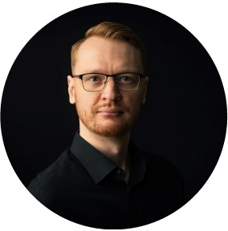

<head>
<base target="_blank">
</head>


# {.tabset .tabset-fade}

## Research 

<!-- /*  <style>     </style> */ -->
```{css, echo=FALSE}

/* avoids scroll bar jump*/
html { 
  margin-left: calc(100vw - 100%); 
}

.main-container {
max-width:  940px;
min-width: 300px !important;
padding-left: 1px;
}

 
h1 { /* Header 1 */
  font-size: 20px;
}
h2 { /* Header 2 */
    font-size: 18px;
}

.list-group-item.active, .list-group-item.active:focus, .list-group-item.active:hover {
    color: black;
    background-color: transparent;

}

#TOC {
  text-align: left;
  padding-left: 0px ;
  padding-right: 0px;
  left: 10px;
  top: 0;
  width: 100%;
}

/* the expander thing*/
details summary::-webkit-details-marker {
  display:none;
}

.twitter-timeline {
    height: 200px !important;
}

```

### New things  

<div class="container-fluid">
<div class="row">
  <div class="col-sm-7">
  <iframe src="news.html" width="100%" height="200" style="border: none;"></iframe>
  </div>
  <div class="col-sm-5">
  <a class="twitter-timeline" 
  data-show-screen-name="false" data-lang="en" 
  data-width="385px" 
  data-height="200px" 
  href="https://twitter.com/AndresKarjus?ref_src=twsrc%5Etfw"
  data-chrome="noheader nofooter">
  " "
  </a> 
<script async src="https://platform.twitter.com/widgets.js" charset="utf-8"></script>
  </div>
</div>

<div class="row">
<div class="col-sm-12">


### What I do

 

<div style="text-align: justify; padding-left:1px"> 
I am a research fellow at the [CUDAN](http://cudan.tlu.ee/) Cultural Data Analytics lab at Tallinn University, working on **language and culture dynamics**, using large corpora, machine learning, and human experiments. Recently I have been also working on, through various collaborations, on art history and creative industries and advising collaborative projects between involving academic and media industry partners.<br>
I defended my PhD in 2020, in linguistics at the [Centre for Language Evolution](http://www.lel.ed.ac.uk/cle/) of University of Edinburgh, on lexical dynamics and communicative need in language.
I also occasionally teach **stats and data visualization** for the humanities and social sciences (see [more here](https://andreskarjus.github.io/artofthefigure)). The photo on the right naturally slightly outdated, as is customary on academic home pages.

### Research

#### Publications 

* Andres Karjus, Mar Canet Solà, Tillmann Ohm, Sebastian Ahnert, Maximilian Schich. 2022. Compression ensembles quantify aesthetic complexity and the evolution of visual art | [arxiv preprint](https://arxiv.org/abs/2205.10271) 
* Andres Karjus, Richard A. Blythe, Simon Kirby, Tianyu Wang, Kenny Smith. 2021. Conceptual similarity and communicative need shape colexification". [Cognitive Science](https://doi.org/10.1111/cogs.13035) (open access) | [pdf](https://andreskarjus.github.io/papers/Karjus_2021__Conceptual_Similarity_and_Communicative_Need_Shape_Colexification_An_Experimental_Study__Cognitive_Science.pdf) |  [bib](https://andreskarjus.github.io/bib/karjus_2021_cogsci.bib) | [code and data](https://github.com/andreskarjus/colexification_experiment)
* Andres Karjus, 2020. Competition, selection and communicative need in language change. PhD thesis, University of Edinburgh | [pdf](https://andreskarjus.github.io/thesis/Andres_Karjus_phd_thesis.pdf) | [1-page non-technical summary](https://andreskarjus.github.io/thesis/english_summary.pdf) | [eestikeelne lühikokkuvõte](https://andreskarjus.github.io/thesis/doktoritoo_ylevaade_AK.pdf)
*  Andres Karjus, Richard A. Blythe, Simon Kirby, Kenny Smith 2020. Communicative need modulates competition in language change | [preprint](https://arxiv.org/abs/2006.09277)
* Andres Karjus, Richard A. Blythe, Simon Kirby, Kenny Smith 2020. Challenges in detecting evolutionary forces in language change using diachronic corpora. Glossa: a journal of general linguistics, 5(1), p.45. | [open access](http://doi.org/10.5334/gjgl.909) | [code](https://github.com/andreskarjus/wfsim_fit)
* Andres Karjus, Richard A. Blythe, Simon Kirby, Kenny Smith, 2020. Quantifying the dynamics of topical fluctuations in language. Language Dynamics and Change 10(1), 86-125 | [open access](https://doi.org/10.1163/22105832-01001200) | [code](https://github.com/andreskarjus/topical_cultural_advection_model)
* Andres Karjus, Martin Ehala, 2018. Testing an agent based model of language choice on sociolinguistic survey data. Language Dynamics and Change, 8, pp. 219-252 | [journal link](https://doi.org/10.1163/22105832-00802004) | [open postprint](Karjus_Ehala_2018_Testing_an_agent-based_model_of_language_choice_LDCpostprint.pdf) | <a href="karjus_testing_2018.bib" target="_blank">bib</a> | sociolinguistic [dataset](http://doi.org/10.15155/1-00-0000-0000-0000-00162L): 1000 respondents, 200 questions
* Andres Karjus, Richard A. Blythe, Simon Kirby, Kenny Smith, 2018. Topical advection as a baseline model for diachronic lexical dynamics. Proceedings of The Society for Computation in Linguistics. Volume 1. [extended abstract, full paper above] | [open access](http://scholarworks.umass.edu/scil/) | <a href="karjus_topical_2018.bib" target="_blank">bib</a>
*	Martin Haspelmath, Andres Karjus, 2017. Explaining asymmetries in number marking: Singulatives, pluratives and usage frequency. Linguistics, volume 55, issue 6. | [journal link](https://www.degruyter.com/view/j/ling.2017.55.issue-6/ling-2017-0026/ling-2017-0026.xml)  | [preprint](https://www.academia.edu/25032500/Explaining_asymmetries_in_number_marking_Singulatives_pluratives_and_usage_frequency) | <a href="haspelmath_explaining_2017.bib" target="_blank">bib</a>

<details><summary> &nbsp;&nbsp;&nbsp;&nbsp;&nbsp;&nbsp;&nbsp;&nbsp; Show older...</summary>

*	Andres Karjus, 2015. Through the Spyglass of Synchrony: Grammaticalization of the Exterior Space in the Eastern Circum-Baltic. In: Hilpert, Martin, Östman, Jan-Ola, Mertzlufft, Christine, Rießler, Michael, Duke, Janet (eds.), Advances in Nordic Linguistics. De Gruyter Mouton.
| [google books](https://books.google.ee/books?id=BPheCAAAQBAJ)
*	Andres Karjus (editor), 2013. Areal linguistics, Grammar and Contacts. Special issue of the Journal of Estonian and Finno-Ugric Linguistics, 4-2. Tartu: University of Tartu Press. 
| [open access](http://jeful.ut.ee/index.php/JEFUL/issue/view/2013.4.2)
* Petar Kehayov, Eva Saar, Miina Norvik, Andres Karjus, 2013. Hääbuva kesklüüdi murde jälgedel suvel 2012 [On the footsteps of vanishing Central Lude in the summer of 2012]. Yearbook of the Estonian Mother Tongue Society, Vol. 58. | [open access](http://www.kirj.ee/public/ESA/2012/esa_58-2012-58-101.indd.pdf)
*	Andres Karjus, 2012. Outdoors on the Shores of the Baltic: Gradience in the Grammaticalization of the Exterior-Region. Journal of Estonian and Finno-Ugric Linguistics 3-1, pp. 209-226.

</details>
<br>

#### Conferences & seminars

- Poster "Linguistic divergence in American English along socio-political polarities", the [IC2S2](https://www.ic2s2.org/) Computational Social Science Conference (20.07.2022) | [pdf](https://andreskarjus.github.io/talks/ic2s2/IC2S2_poster_Linguistic_divergence_in_American_English_along_socio-political_polarities.pdf)
- Seminar talk at the Poncelet laboratory in Moscow (November 2021)
- [Conference on Complex Systems 2021](https://ccs2021.univ-lyon1.fr/) (October 2021) | [slides](https://andreskarjus.github.io/talks/ccs2021/Karjus_CCS2021_Capturing_aesthetic_complexity.pdf)
- [Protolang 7](https://blogs.phil.hhu.de/protolang7/programme/) (September 2021) | [slides](https://andreskarjus.github.io/talks/andres_karjus_protolang7.pdf)
- [Culture Conference 2021](https://culture-conference.com/) | [Poster on aesthetic complexity](https://andreskarjus.github.io/talks/cultureconference2021/)
- [TÜling](https://www.keel.ut.ee/et/tuling) (April 2021)
- [Colloquium for Computational Linguistics and Linguistics in Stuttgart](https://www.ims.uni-stuttgart.de/en/research/colloquium/) | [Slides](https://andreskarjus.github.io/talks/stuttgart2021/andres_karjus_lexical_dynamics_slides_stuttgart2021.pdf) | [Recording](https://www.ims.uni-stuttgart.de/documents/aktuelles/veranstaltungen/210111-Karjus-Talk-Colloq-Recording.mp4)
- [RUSE 2019](http://rusesymposium.org.uk/). Slides [here](https://andreskarjus.github.io/ruse2019).
- [CL2019](http://www.cl2019.org/). Slides [here](https://andreskarjus.github.io/cl2019talk.html).
- [Culture Conference 2019](https://culture-conference.com/programme-2019/), Poster [here](https://andreskarjus.github.io/lexcom_poster).
- [Inaugural ISLE workshop](https://www.comparativelinguistics.uzh.ch/en/events/ISLE-inaugural-workshop.html) | _Modelling lexical interactions in diachronic corpora_ |  [poster](https://andreskarjus.github.io/isle_poster)
- University of Edinburgh [Centre for Language Evolution](http://www.lel.ed.ac.uk/cle/) seminar series | _Challenges in detecting evolutionary forces in language change using diachronic corpora_ | [slides](https://andreskarjus.github.io/evoforces_cletalk/slides.html) | [code](https://github.com/andreskarjus/wfsim_fit)
- Corpus Linguistics in Scotland Network Meeting, _Topical Fluctuations and Lexical Interactions in Diachronic Corpora_

<details><summary> &nbsp;&nbsp;&nbsp;&nbsp;&nbsp;&nbsp;&nbsp;&nbsp; Show older...</summary>

- New directions in language evolution research workshop, at the [SLE 2018](http://sle2018.eu/) | _Two problems and solutions in evolutionary corpus-based language dynamics research_ | [slides](https://andreskarjus.github.io/sle_tallinn_languagedynamics) with interactive plots | [code](https://github.com/andreskarjus/sle_tallinn_languagedynamics)
- [Applications in Cultural Evolution: Arts, Languages, Technologies](https://cultevol.ut.ee/) | _Selection above the baseline: quantifying the advection effect in four domains of cumulative culture_ | [slides](https://andreskarjus.github.io/cultevol_tartu_slides) with interactive data&plots | [code](https://github.com/andreskarjus/cultural_advection_Tartuce)
- [Evolang 2018](http://evolang.cles.umk.pl) | [slides](https://drive.google.com/open?id=10az7BOV_tT-mAwMZXDoguKmZeTErnfzB) | open-access [proceedings](http://evolang.org/torun/proceedings/papertemplate.html?p=117) 
- [Edinburgh Language Lunch](http://groups.inf.ed.ac.uk/langlunch/)
- The inaugural meeting of the Society for Computation in Linguistics, part of [LSA 2018](https://www.linguisticsociety.org/event/lsa-2018-annual-meeting) | download [poster](scilposter_sizeA1.pdf)

</details>

---
<br>

</div>
</div>
</div>


## R workshops {#workshops}

If you're here about materials for an upcoming R or dataviz workshop: [click here](https://andreskarjus.github.io/artofthefigure/) to go to the dedicated workshops page.

<div style="text-align: justify"> 

**Workshops**

- I have been developing teaching materials on data visualization using R, which I have used in over a dozen workshops for humanities and social science audiences since 2017, collectively under the title of [_aRt of the Figure_ (click here for more info)](https://andreskarjus.github.io/artofthefigure/). Some of these have been standalone events, some have been part of conferences, summer schools or academic retreats. All my materials are [open source](https://andreskarjus.github.io/artofthefigure/).

**Teaching**

- My postdoc includes some teaching activities, and I do occasional guest lectures; most recently for the Data Science and Digital Humanities programme at the University of Tartu and for the Cultural Data Analytics I and II courses at Tallinn University.

**Past teaching**

- I was engaged in teaching stats and R to [Edinburgh Uni psychology](https://www.ed.ac.uk/ppls/psychology) masters students 2017-2019.
- And worked for the Edinburgh University School of Psychology, Philosophy and Language Sciences Writing Centre 2017-2020 as awritten communication consultant, specializing in writing about and presenting data and data analysis results.
- Developed and co-taught a course on data analysis for digital humanities at the University of Tartu in the spring of 2016.
- Lectured on corpus linguistics and R for the [Academia Salensis](http://academiasalensis.org) summer school of 2015.
- Worked as a teaching assistant for courses on language technology and artificial intelligence, Department of Computer Science, University of Tartu, 2014-2016.
<br><br>

Feel free to get in touch if you are interested in talking about organizing a workshop on anything related to data science and statistics, data visualization, R, corpus linguistics, natural language processing applications, digital humanities, etc.
</div>
<br>

## Other things
### Semi-academic & science popularization stuff
<div style="text-align: justify"> 

- Hosted students at the CUDAN lab via the job shadowing (töövari) programme of the Estonian Tagasi Kooli programme (online April 2021, live in November 2020).
- I helped my supervisor Prof. Kenny Smith carry out a number of linguistics workshops in primary schools around Edinburgh and Lothian, in school years 2018/2019 and 2019/2020.
- Entered [a video](https://www.youtube.com/watch?v=t8InfFEIINc) to Science Magazine's 11th [Dance Your Ph.D contest](https://www.sciencemag.org/projects/dance-your-phd). The idea is to explain your research topic to the general public though interpretive dance. We didn't win but it was a fun one to do!
- Co-organized the bimonthly [Edinburgh Language Lunch](http://groups.inf.ed.ac.uk/langlunch/) during 2016-2018. 
- Co-organized the [Linguistics and English Language Postgraduate Conference](http://www.lel.ed.ac.uk/~pgc/) of 2017 in Edinburgh, the [Why Linguistics Conference](http://whylinguistics.ut.ee) (2015) and the [Graduate Conference on Areal Linguistics, Grammar and Contacts](http://arealling.ut.ee) (2012) in Tartu, Estonia. 

### Non-academic stuff

Besides research and teaching and consulting and whatnot, I (fortunately) also do some other things, which mostly consist of dance (lindy hop, salsa, bachata), boardgames, and outdoorsy stuff (running, hillwalking).

### Before Edinburgh

In the more distant past, I worked as a teaching assistant in informatics at the University of Tartu (2015-2016), before that studied artificial intelligence and natural language processing at KU Leuven (MSc) and linguistics at the University of Tartu (BA, MA). I was also affiliated 2016-2019 as a (part-time) junior researcher with the University of Tartu [EKKAM](http://ekkam.ut.ee/en/) sociolinguistics group, doing data analysis and agent-based models. 
During my pre-PhD studies I also went on exchanges to the University of Iceland and the University Vienna, attended a dozen-odd academic summer schools, taught Icelandic to art students and Estonian to Norwegian teachers, worked as an assistant at the Estonian Wordnet project, and did internships at CrossLang NV in Belgium and at (the old) Linguistics Departent of the Max Planck Institute for Evolutionary Anthropology in Leipzig. In earlier years, I worked various studenty sort of jobs to support my studies (for a seller of swords, for a seller of cars, for a minder of horses and tourists).
</div>
<br>

## Contact
<br>
<br>

<div style="text-align: center; align:center"> 
 
<br>
<br>
<br>
Andres Karjus, research fellow, CUDAN lab, Tallinn University<br>
&nbsp;&nbsp;&nbsp;<a href="mailto:andres.karjus --at-- tlu.ee">email</a>  |  <a href="https://twitter.com/AndresKarjus">twitter</a>
<br>
</div>

