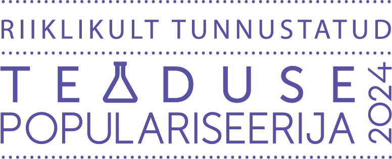
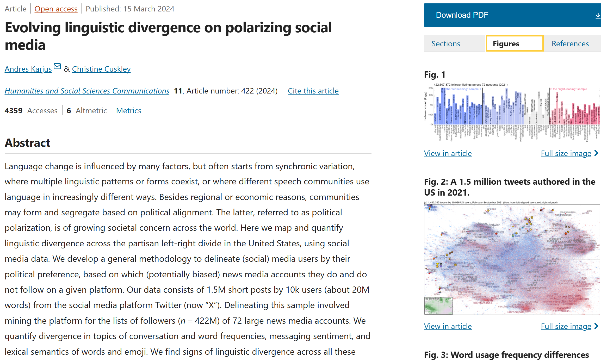
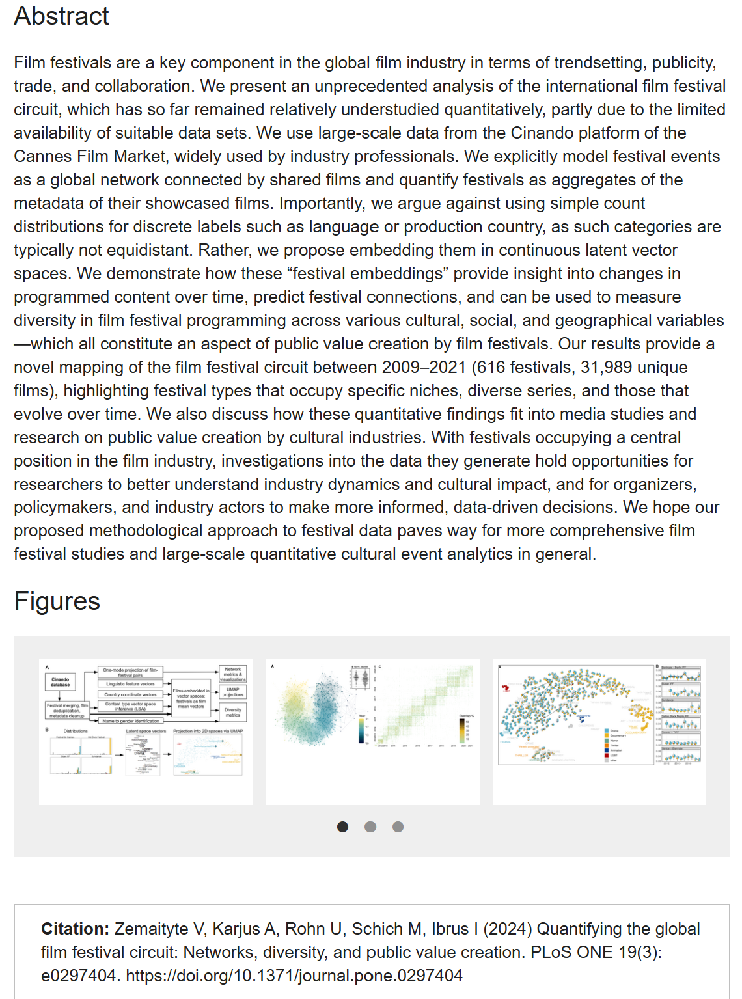
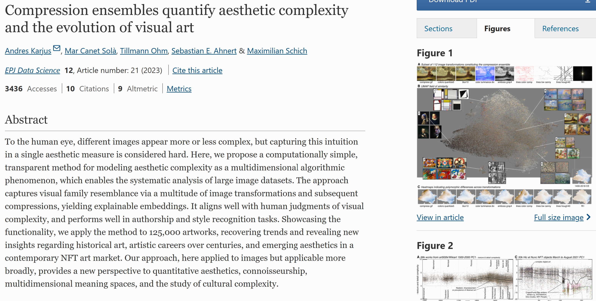
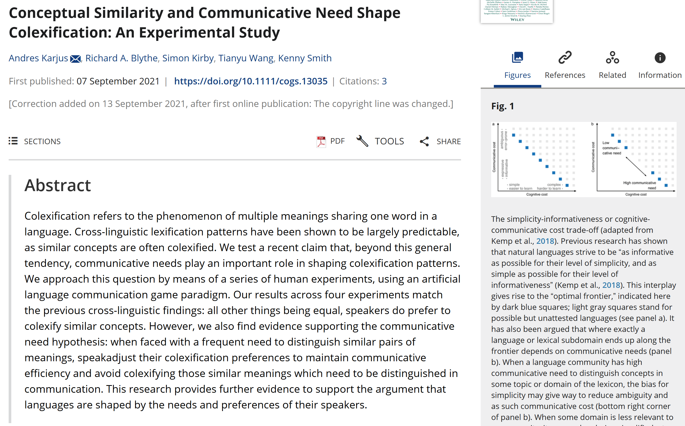

<head>
<base target="_blank">
</head>


# {.tabset .tabset-fade}

## Research 

<!-- /*  <style>     </style> */ -->
```{css, echo=FALSE}

/* avoids scroll bar jump*/
html { 
  margin-left: calc(100vw - 100%); 
}

.main-container {
max-width:  940px;
min-width: 300px !important;
padding-left: 1px;
}

 
h1 { /* Header 1 */
  font-size: 20px;
}
h2 { /* Header 2 */
    font-size: 18px;
}

.list-group-item.active, .list-group-item.active:focus, .list-group-item.active:hover {
    color: black;
    background-color: transparent;

}

#TOC {
  text-align: left;
  padding-left: 0px ;
  padding-right: 0px;
  left: 10px;
  top: 0;
  width: 100%;
}

/* the expander thing*/
details summary::-webkit-details-marker {
  display:none;
}

<!-- .twitter-timeline { -->
<!--     height: 200px !important; -->
<!--     overflow: scroll !important; -->
<!-- } -->


/* no indent bullets */
ul {
  margin: 0; /* Removes any default margin */
  padding-left: 15px; /* Moves bullets slightly to the left */
  list-style-position: outside; /* Keeps bullets outside the text block */
}


.profilepic {
  float: right; /* Ensures the image is aligned to the right */
  margin: 10px -5px 10px 10px; /* Adds space on all sides except the right */
  width: 15%; /* Set image width to match your preference */
  height: auto; /* Maintain aspect ratio */
  position: relative; /* Ensure proper positioning */
}

/* General styling for thumbnails */
.thumbnail {
  float: right; /* Ensures the image is aligned to the right */
  margin: 10px; /* Adds space between the image and text */
  margin-right: 0px;
  width: 20%; /* Set image width */
  height: auto; /* Maintain aspect ratio */
  transition: transform 0.3s ease, z-index 0.3s ease; /* Smooth scaling effect */
  position: relative;
  cursor: pointer;
  transform-origin: top right; /* Expands to the left */
}

.thumbnail:hover {
  transform: scale(3); /* Expands the image */
  z-index: 10; /* Ensures the image overlaps other elements */
}

/* Disable hover effects on smaller screens */
@media screen and (max-width: 768px) {
  .thumbnail:hover {
    transform: none;
    z-index: auto;
  }
}


```


### New things

<iframe src="news.html" width="100%" height="110" style="border: 1px solid #ccc; border-radius: 4px; box-shadow: 0 4px 6px rgba(0, 0, 0, 0.1);"></iframe>


<br>


### What I do

<div style="text-align: justify; padding-left:1px">
I work on language and culture dynamics, using large corpora, machine learning & AI, and cognitive experiments. Recently I have been also collaborating on art history and creative industries projects, and advising cross-sector initiatives between academia and the public and private sectors. I am affiliated with Tallinn University as a lecturer in digital humanities and artificial intelligence (and a member of the [CUDAN](http://cudan.tlu.ee/) Cultural Data Analytics lab), and with [Estonian Business School](https://www.ebs.ee/en) as senior researcher.
I did my PhD at the [Centre for Language Evolution](http://www.lel.ed.ac.uk/cle/) of the University of Edinburgh, on lexical dynamics and communicative need in language. <br>
I also occasionally do consulting and workshops on request on **R**, stats & data visualization, and generative **AI** (see [more here](https://datafigure.eu)). 
I was recently granted the title of "Nationally Recognized Science Communicator" (riiklikult tunnustatud teaduse populariseerija) by the Estonian Science Foundation. <br>

<div style="clear: both; margin-top: 10px;"></div>


### Research

#### Publications (including in-review preprints)

2024  <a href="https://www.nature.com/articles/s41599-024-02922-9" target="_blank">
    
  </a>

* Andres Karjus and Christine Cuskley. 2024. Evolving Linguistic Divergence on Polarizing Social Media | Nature Humanities and Social Sciences Communications [open access](https://doi.org/10.1057/s41599-024-02922-9) 
* Mark Mets, Andres Karjus, Indrek Ibrus, Maximilian Schich. 2023. Automated stance detection in complex topics and small languages: the challenging case of immigration in polarizing news media | PLOS One [open access](https://doi.org/10.1371/journal.pone.0302380)
* Oiva, Mila, Ksenia Mukhina, Vejune Zemaityte, Tillmann Ohm, Mikhail Tamm, Andres Karjus, Mark Mets, Daniel Chávez Heras Mar Canet Solà, Helena Hanna Juht, Maximilian Schich. 2023. A Framework for the Analysis of Historical Newsreels | Nature Humanities and Social Sciences Communications [open access](https://doi.org/10.1057/s41599-024-02886-w)
* Yan Asadchy; Karjus, Andres; Mukhina, Ksenia; Schich, Maximilian. 2024. Perceived gendered self-representation on Tinder using machine learning | Nature Humanities and Social Sciences Communications [open access](https://doi.org/10.1057/s41599-024-03801-z)
* Tillmann Ohm, A Karjus, M Tamm, M Schich. 2024. fruit-SALAD: A Style Aligned Artwork Dataset to reveal similarity perception in image embeddings | [preprint](https://arxiv.org/abs/2406.01278)    <a href="https://journals.plos.org/plosone/article?id=10.1371/journal.pone.0297404" target="_blank">
    </a>
* Andres Karjus, Vejune Zemaityte. 2024. Socioeconomic factors of national representation in the global film festival circuit: skewed toward the large and wealthy, but small countries can beat the odds | [preprint](https://arxiv.org/abs/2407.10755)    
* Vejune Zemaityte and Andres Karjus (co-first), Ulrike Rohn, Maximilian Schich, Indrek Ibrus. 2024. Quantifying the global film festival circuit: Networks, diversity, and public value creation | PLOS One [open access](https://doi.org/10.1371/journal.pone.0297404) | [code, data & interactive dashboard](https://andreskarjus.github.io/cinandofestivals)  


<br>2023

* Andres Karjus. 2023. Machine-assisted mixed methods: augmenting humanities and social sciences with artificial intelligence | [preprint](https://arxiv.org/abs/2309.14379) (in press)
* Indrek Ibrus, Andres Karjus, Vejune Zemaityte, Ulrike Rohn, Maximilian Schich. 2023. Quantifying public value creation by public service media using big programming data.  International Journal Of Communication, 17, 24. | [open access](https://ijoc.org/index.php/ijoc/article/view/21035) 
* Juan Guerrero Montero, Andres Karjus, Kenny Smith, Richard A. Blythe. 2023. Reliable identification of selection mechanisms in language change. Corpus Linguistics and Linguistic Theory | [Open access](https://doi.org/10.1515/cllt-2023-0064)
* Tillmann Ohm, Mar Canet Solà, Andres Karjus, Maximilian Schich. 2023. Collection Space Navigator: An Interactive Visualization Interface for Multidimensional Datasets. VINCI 2023: Proceedings of the 16th International Symposium on Visual Information Communication and Interaction. | [open access](doi.acm.org?doi=3615522.3615546) | [extended preprint](https://arxiv.org/abs/2305.06809) | [interactive demo](https://collection-space-navigator.github.io/) | [code](https://github.com/Collection-Space-Navigator/CSN)    <a href="https://epjdatascience.springeropen.com/articles/10.1140/epjds/s13688-023-00397-3" target="_blank">
    </a>
* Andres Karjus, Mar Canet Solà, Tillmann Ohm, Sebastian Ahnert, Maximilian Schich. 2023. Compression ensembles quantify aesthetic complexity and the evolution of visual art. EPJ Data Science. 12, 21. | [open access](https://doi.org/10.1140/epjds/s13688-023-00397-3) | [code](https://github.com/andreskarjus/compression_ensembles) 
* Mehmet Burak Yilmaz, Elen Lotman, Andres Karjus, Pia Tikka. 2023. An embodiment of the cinematographer: emotional and perceptual responses to different camera movement techniques. Frontiers Neuroscience | [open access](https://doi.org/10.3389/fnins.2023.1160843) | [data](https://zenodo.org/record/7979713)


<br>2022

* Andres Karjus, Christine Cuskley. 2022. Evolving linguistic divergence in socio-political polarities. Proceedings of the Joint Conference on Language Evolution (JCoLE). | [proceedings pdf](http://www.evolang.org/jcole2022_proceedings/jcole2022_proceedings.pdf) 

2021    <a href="https://doi.org/10.1111/cogs.13035" target="_blank"></a>


* Andres Karjus, Richard A. Blythe, Simon Kirby, Tianyu Wang, Kenny Smith. 2021. Conceptual similarity and communicative need shape colexification. [Cognitive Science](https://doi.org/10.1111/cogs.13035) (open access) |  [bib](https://andreskarjus.github.io/bib/karjus_2021_cogsci.bib) | [code and data](https://github.com/andreskarjus/colexification_experiment)

<br>2020

* Andres Karjus, 2020. Competition, selection and communicative need in language change. PhD thesis, University of Edinburgh | [pdf](https://andreskarjus.github.io/thesis/Andres_Karjus_phd_thesis.pdf) | [1-page non-technical summary](https://andreskarjus.github.io/thesis/english_summary.pdf) | [eestikeelne lühikokkuvõte](https://andreskarjus.github.io/thesis/doktoritoo_ylevaade_AK.pdf)
*  Andres Karjus, Richard A. Blythe, Simon Kirby, Kenny Smith 2020. Communicative need modulates competition in language change | [preprint](https://arxiv.org/abs/2006.09277)
* Andres Karjus, Richard A. Blythe, Simon Kirby, Kenny Smith 2020. Challenges in detecting evolutionary forces in language change using diachronic corpora. Glossa: a journal of general linguistics, 5(1), p.45. | [open access](http://doi.org/10.5334/gjgl.909) | [code](https://github.com/andreskarjus/wfsim_fit)
* Andres Karjus, Richard A. Blythe, Simon Kirby, Kenny Smith, 2020. Quantifying the dynamics of topical fluctuations in language. Language Dynamics and Change 10(1), 86-125 | [open access](https://doi.org/10.1163/22105832-01001200) | [code](https://github.com/andreskarjus/topical_cultural_advection_model)

<br>2018

* Andres Karjus, Martin Ehala, 2018. Testing an agent based model of language choice on sociolinguistic survey data. Language Dynamics and Change, 8, pp. 219-252 | [journal link](https://doi.org/10.1163/22105832-00802004) | [open postprint](Karjus_Ehala_2018_Testing_an_agent-based_model_of_language_choice_LDCpostprint.pdf) | <a href="karjus_testing_2018.bib" target="_blank">bib</a> | sociolinguistic [dataset](http://doi.org/10.15155/1-00-0000-0000-0000-00162L): 1000 respondents, 200 questions
* Andres Karjus, Richard A. Blythe, Simon Kirby, Kenny Smith, 2018. Topical advection as a baseline model for diachronic lexical dynamics. Proceedings of The Society for Computation in Linguistics. Volume 1. [extended abstract, full paper above] | [open access](http://scholarworks.umass.edu/scil/) | <a href="karjus_topical_2018.bib" target="_blank">bib</a>

2017

*	Martin Haspelmath, Andres Karjus, 2017. Explaining asymmetries in number marking: Singulatives, pluratives and usage frequency. Linguistics, volume 55, issue 6. | [journal link](https://www.degruyter.com/view/j/ling.2017.55.issue-6/ling-2017-0026/ling-2017-0026.xml)  | [preprint](https://www.academia.edu/25032500/Explaining_asymmetries_in_number_marking_Singulatives_pluratives_and_usage_frequency) | <a href="haspelmath_explaining_2017.bib" target="_blank">bib</a>

<details><summary> &nbsp;&nbsp;&nbsp;&nbsp;&nbsp;&nbsp;&nbsp;&nbsp; Show older...</summary>

*	Andres Karjus, 2015. Through the Spyglass of Synchrony: Grammaticalization of the Exterior Space in the Eastern Circum-Baltic. In: Hilpert, Martin, Östman, Jan-Ola, Mertzlufft, Christine, Rießler, Michael, Duke, Janet (eds.), Advances in Nordic Linguistics. De Gruyter Mouton.
| [google books](https://books.google.ee/books?id=BPheCAAAQBAJ)
*	Andres Karjus (editor), 2013. Areal linguistics, Grammar and Contacts. Special issue of the Journal of Estonian and Finno-Ugric Linguistics, 4-2. Tartu: University of Tartu Press. 
| [open access](http://jeful.ut.ee/index.php/JEFUL/issue/view/2013.4.2)
* Petar Kehayov, Eva Saar, Miina Norvik, Andres Karjus, 2013. Hääbuva kesklüüdi murde jälgedel suvel 2012 [On the footsteps of vanishing Central Lude in the summer of 2012]. Yearbook of the Estonian Mother Tongue Society, Vol. 58. | [open access](http://www.kirj.ee/public/ESA/2012/esa_58-2012-58-101.indd.pdf)
*	Andres Karjus, 2012. Outdoors on the Shores of the Baltic: Gradience in the Grammaticalization of the Exterior-Region. Journal of Estonian and Finno-Ugric Linguistics 3-1, pp. 209-226.

</details>
<br>

#### Conferences & seminars (probably not complete list)

- Presentation and workshop at the Meertens Institute on [AI in humanities](https://meertens.knaw.nl/meertens-event/23-24-oktober-2024-lezing-en-workshop-van-andres-karjus-hoe-grote-taalmodellen-ai-kunnen-helpen-bij-onderzoek/)
- Poster at DHNB2024 in Iceland
- Talk at the AI workshop we organized at [Evolang](https://www.changeiskey.org/event/2024-evolang-workshop/) (May 2024)
- Talk on AI & humanities research at the 67. Kreutzwald Day conference in Tartu
- Talk at the [Cultural Data Analytics Conference 2023](https://cudan.tlu.ee/conference/) 14.12.2023 in Tallinn on using LLMs in a systematic mixed methods framework for large scale humanities & social science research | [slides](https://andreskarjus.github.io/talks/LLMs_humanities_talk_CUDAN2023_AndresKarjus.pdf)
- Poster on AI & humanities research at the Computational Humanities Research conference [CHR 2023](https://2023.computational-humanities-research.org/) in Paris
- Talk at the Tekstipäev (Day of the Text) in Tartu on AI & humanities research (30.11.2023)
- Talk at the Tallinn University School of Humanities seminar on AI & humanities research
- Seminar talk at the Change is Key project at the University of Gothenburg.
- Talk on LLMs for studying texts and change at "Assessing and measuring systems change" workshop | [slides](https://andreskarjus.github.io/talks/Tartu_LLMtalk.pdf)
- Poster on film festival research at Netsci 2023, Vienna
- Presentation at the Bibliotheca Herziana workshop on computational approaches to art
- Talk "Programming, data visualization & AI  for academic audiences across institutions and disciplines: lessons learned", at the Cross-university collaboration in Digital Humanities & Social Science (DHSS) and Digital Humanities & Cultural Heritage (DHCH) Education workshop of the DHNB2023 conference | [slides](https://datafigure.eu/reports/AndresKarjusDatafigure_CrossUniversityDHworkshop.pdf)
- Talk "Exploring Estonian Public Television Production 2004-2020 Using Big Programming Data" at the 8th Estonian Digital Humanities [Conference](https://dh.org.ee/events/dhe2022) (05.10.2022)
- Poster "Evolving Linguistic Divergence in Socio-Political Polarities", at the [JCoLe](https://sites.google.com/view/joint-conf-language-evolution) Joint Conference on Language Evolution in Kanazawa, Japan (August 2022)
- Poster "Linguistic divergence in American English along socio-political polarities", the [IC2S2](https://www.ic2s2.org/) Computational Social Science Conference (20.07.2022) | [pdf](https://andreskarjus.github.io/talks/ic2s2/IC2S2_poster_Linguistic_divergence_in_American_English_along_socio-political_polarities.pdf)
- Seminar talk at the Poncelet laboratory in Moscow (November 2021)
- [Conference on Complex Systems 2021](https://ccs2021.univ-lyon1.fr/) (October 2021) | [slides](https://andreskarjus.github.io/talks/ccs2021/Karjus_CCS2021_Capturing_aesthetic_complexity.pdf)
- [Protolang 7](https://blogs.phil.hhu.de/protolang7/programme/) (September 2021) | [slides](https://andreskarjus.github.io/talks/andres_karjus_protolang7.pdf)
- [Culture Conference 2021](https://culture-conference.com/) | [Poster on aesthetic complexity](https://andreskarjus.github.io/talks/cultureconference2021/)
- [TÜling](https://www.keel.ut.ee/et/tuling) (April 2021)
- [Colloquium for Computational Linguistics and Linguistics in Stuttgart](https://www.ims.uni-stuttgart.de/en/research/colloquium/) | [Slides](https://andreskarjus.github.io/talks/stuttgart2021/andres_karjus_lexical_dynamics_slides_stuttgart2021.pdf) | [Recording](https://www.ims.uni-stuttgart.de/documents/aktuelles/veranstaltungen/210111-Karjus-Talk-Colloq-Recording.mp4)
- [RUSE 2019](http://rusesymposium.org.uk/). Slides [here](https://andreskarjus.github.io/ruse2019).
- [CL2019](http://www.cl2019.org/). Slides [here](https://andreskarjus.github.io/cl2019talk.html).
- [Culture Conference 2019](https://culture-conference.com/programme-2019/), Poster [here](https://andreskarjus.github.io/lexcom_poster).
- [Inaugural ISLE workshop](https://www.comparativelinguistics.uzh.ch/en/events/ISLE-inaugural-workshop.html) | _Modelling lexical interactions in diachronic corpora_ |  [poster](https://andreskarjus.github.io/isle_poster)
- University of Edinburgh [Centre for Language Evolution](http://www.lel.ed.ac.uk/cle/) seminar series | _Challenges in detecting evolutionary forces in language change using diachronic corpora_ | [slides](https://andreskarjus.github.io/evoforces_cletalk/slides.html) | [code](https://github.com/andreskarjus/wfsim_fit)
- Corpus Linguistics in Scotland Network Meeting, _Topical Fluctuations and Lexical Interactions in Diachronic Corpora_

<details><summary> &nbsp;&nbsp;&nbsp;&nbsp;&nbsp;&nbsp;&nbsp;&nbsp; Show older...</summary>

- New directions in language evolution research workshop, at the [SLE 2018](http://sle2018.eu/) | _Two problems and solutions in evolutionary corpus-based language dynamics research_ | [slides](https://andreskarjus.github.io/sle_tallinn_languagedynamics) with interactive plots | [code](https://github.com/andreskarjus/sle_tallinn_languagedynamics)
- [Applications in Cultural Evolution: Arts, Languages, Technologies](https://cultevol.ut.ee/) | _Selection above the baseline: quantifying the advection effect in four domains of cumulative culture_ | [slides](https://andreskarjus.github.io/cultevol_tartu_slides) with interactive data&plots | [code](https://github.com/andreskarjus/cultural_advection_Tartuce)
- [Evolang 2018](http://evolang.cles.umk.pl) | [slides](https://drive.google.com/open?id=10az7BOV_tT-mAwMZXDoguKmZeTErnfzB) | open-access [proceedings](http://evolang.org/torun/proceedings/papertemplate.html?p=117) 
- [Edinburgh Language Lunch](http://groups.inf.ed.ac.uk/langlunch/)
- The inaugural meeting of the Society for Computation in Linguistics, part of [LSA 2018](https://www.linguisticsociety.org/event/lsa-2018-annual-meeting) | download [poster](scilposter_sizeA1.pdf)

</details>

---
<br>


## Teaching {#workshops}

<br> 

**Private sector**

I also teach workshops as an instructor and provide consulting in the private sector. 
These have taken the form of invited workshop and seminars, standalone events, or components of conferences, summer schools or academic retreats.
Feel free to get in touch if you are interested in talking about organizing a workshop on anything related to data science and statistics, digital skills, artificial intelligence, data visualization, R, corpus linguistics, digital humanities, etc. <br>
For more details, pricing and contact, head over to [datafigure.eu](https://datafigure.eu)

<div style="text-align: justify"> 


**Academic teaching**

My position now includes some teaching activities on digital skills and AI, and I do occasional guest lectures; recently for the Data Science and Digital Humanities programme at the University of Tartu and for the Cultural Data Analytics I and II courses at Tallinn University.

**Past teaching**

- I was engaged in teaching stats and R to [Edinburgh Uni psychology](https://www.ed.ac.uk/ppls/psychology) masters students 2017-2019.
- And worked for the Edinburgh University School of Psychology, Philosophy and Language Sciences Writing Centre 2017-2020 as awritten communication consultant, specializing in writing about and presenting data and data analysis results.
- Developed and co-taught a course on data analysis for digital humanities at the University of Tartu in the spring of 2016.
- Lectured on corpus linguistics and R for the [Academia Salensis](http://academiasalensis.org) summer school of 2015.
- Worked as a teaching assistant for courses on language technology and artificial intelligence, Department of Computer Science, University of Tartu, 2014-2016.
<br><br>


</div>
<br>

## Popsci & misc
<div style="text-align: justify"> 

<br>

**Various essays, media appearances and interviews in Estonian media:**

- Was awarded the "Nationally Recognized Science Communicator" (riiklikult tunnustatud teaduse populariseerija) title at the annual Science Popularization prize 2024 of the Estonian Science Foundation | [press](https://www.tlu.ee/ht/uudised/tallinna-ulikooli-teadlased-palvisid-teaduse-populariseerimise-preemia)
- Appeared in [Kultuuristuudio](https://kultuur.err.ee/1609521805/ajaloolane-kaarel-piirimae-usun-et-tehisintellekt-aitab-valenarratiive-vahendada) on ETV2 TV channel
- Appeared in [Raadio2](https://r2.err.ee/1609521341/andres-karjus-mis-asi-on-ai-treenimine) "Päev" radio segment on training AI
- "1 minute science" video segment in [Novaator](https://novaator.err.ee/1609491088/minutiloeng-kuidas-tehisaru-humanitaare-aidata-saab) on using AI and ML in humanities
- An essay with colleagues in [Sirp](https://sirp.ee/s1-artiklid/c21-teadus/tehisintellekt-ja-humanitaarteadused-kes-vajab-keda/) on humanities and AI
- A piece on AI and education, with colleagues in the Estonian culture journal [Sirp](https://www.sirp.ee/s1-artiklid/c21-teadus/millest-me-raagime-kui-raagime-tehisintellektist-hariduses)
- Wrote an opinion piece in ERR [Novaator](https://novaator.err.ee/1609007981/andres-karjus-tehisintellekt-seab-juba-sel-sugisel-koolid-sundvaliku-ette) on how generative AI will affect education in the near future (16.06.2023)
- Gave a number of interviews on artificial intelligence and education topics in 2023 (in Estonian):
[Kanal2 Õhtu](https://duoplay.ee/5826/ohtu?ep=749),
[Äripäev radio](https://www.aripaev.ee/saated/2023/03/30/tehisintellekt-muudab-taiskasvanute-oppimist-ja-opikogemust), 
[TÜHI Eeter podcast](https://www.levila.ee/raadio/tuhi-eeter/kumb-on-arukam-kas-inimaru-voi-tehisaru), [PostimeesTV](https://haridus.postimees.ee/7722633/ekspert-eetris-andres-karjus-kas-chatgpt-hakkab-mojutama-meie-vaartusi-ja-kaitumist), BFM [Luna TV](https://www.youtube.com/watch?v=cXpNkDgfP7Y),  [Postimees](https://www.postimees.ee/7717736/tehisintellekti-abil-kodutoo-kirjutajaid-on-pea-voimatu-vahele-votta)
- News piece in [Pealinn](https://pealinn.ee/2022/09/29/vaata-millised-ettevotjad-saavad-tanavu-tunnustamise-osaliseks-ja-voidavad-auhinna/) on Tallinn city enterpreneurship prizes 2022, including me & colleagues for our media monitoring AI prototype in collaboration with AS Ekspress Grupp.
- Hosted students at the CUDAN lab via the job shadowing (töövari) programme of the Estonian Tagasi Kooli programme (online April 2021, live in November 2020).
- I helped my supervisor Prof. Kenny Smith carry out a number of linguistics workshops in primary schools around Edinburgh and Lothian, in school years 2018/2019 and 2019/2020.
- Entered [a video](https://www.youtube.com/watch?v=t8InfFEIINc) to Science Magazine's 11th [Dance Your Ph.D contest](https://www.sciencemag.org/projects/dance-your-phd). The idea is to explain your research topic to the general public though interpretive dance. We didn't win but it was a fun one to do!
- Co-organized the bimonthly [Edinburgh Language Lunch](http://groups.inf.ed.ac.uk/langlunch/) during 2016-2018. 
- Co-organized the [Linguistics and English Language Postgraduate Conference](http://www.lel.ed.ac.uk/~pgc/) of 2017 in Edinburgh, the [Why Linguistics Conference](http://whylinguistics.ut.ee) (2015) and the [Graduate Conference on Areal Linguistics, Grammar and Contacts](http://arealling.ut.ee) (2012) in Tartu, Estonia. 

**Non-academic stuff**

Besides research and teaching and consulting and whatnot, I (fortunately) also do some other things, which mostly consist of dance (lindy hop, salsa, bachata), boardgames, and outdoorsy stuff (running, hiking).

**Before the PhD in Edinburgh**

In the more distant past, I worked as a teaching assistant in informatics at the University of Tartu (2015-2016), before that studied artificial intelligence and natural language processing at KU Leuven (MSc) and linguistics at the University of Tartu (BA, MA). I was also affiliated 2016-2019 as a (part-time) junior researcher with the University of Tartu EKKAM sociolinguistics group, doing data analysis and agent-based models. 
During my pre-PhD studies I also went on exchanges to the University of Iceland and the University Vienna, attended a dozen-odd academic summer schools, taught Icelandic to art students and Estonian to Norwegian teachers, worked as an assistant at the Estonian Wordnet project, and did internships at CrossLang NV in Belgium and at (the old) Linguistics Departent of the Max Planck Institute for Evolutionary Anthropology in Leipzig. In earlier years, I worked various studenty sort of jobs to support my studies (for a seller of swords, for a seller of cars, for a minder of horses and tourists).
</div>
<br>

## Contact
<br>
<br>

<div style="text-align: center; align:center"> 
<br>
**Andres Karjus** <br><br>
PhD, MA (linguistics), MSc (artificial intelligence)

Lecturer in digital humanities and AI at Tallinn University <br>
Senior research fellow at Estonian Business School <br>
Instructor at <a href=https://datafigure.eu>Datafigure OÜ</a>

Academic email: andres.karjus --at-- tlu.ee <br>
Business and workshop inquiries: kindly contact via the Datafigure <a href=https://datafigure.eu/contact.html>email</a>   
<br>
<br>
Bluesky: <a href=https://bsky.app/profile/andreskarjus.bsky.social>bsky.app/profile/andreskarjus.bsky.social</a> <br>
Twitter (never calling it X) <a href=https://twitter.com/AndresKarjus>twitter.com/AndresKarjus</a> <br>
Mastodon: <a href=https://mastodon.social/@andreskarjus>mastodon.social/@AndresKarjus</a>
<br>
LinkedIn: <a href="https://www.linkedin.com/in/andreskarjus/">www.linkedin.com/in/andreskarjus/</a> <br> 
</div>


