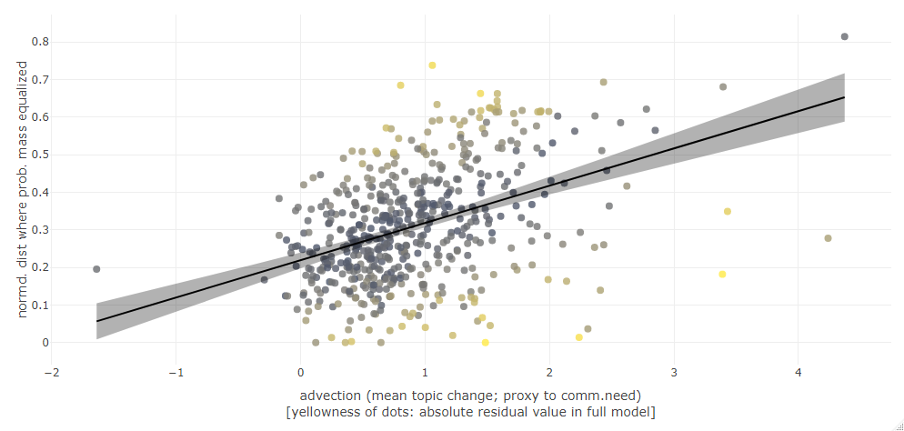

<<<<<<< HEAD
---
title: "<span style='line-height:60px; font-size:60px'>Changing communicative need<br>predicts lexical competition<br>and contributes<br>to language change</span></font>"
author: "<font size=6>Andres Karjus, Richard A. Blythe, Simon Kirby, Kenny Smith<br></font><font size=5>Centre for Language Evolution, University of Edinburgh</font>"
date: "<font size=5>RUSE Symposium, Manchester, August 2019</font>"
output:
  xaringan::moon_reader:
    css: img/xaringan-themer.css
    lib_dir: libs
    nature:
      highlightStyle: github
      highlightLines: false
      countIncrementalSlides: false
      ratio: "16:9"
      navigation:
        scroll: false
---
class: inverse
# All languages change

<style>
.remark-slide-content {
  padding-top: 7px;
  padding-left: 25px;
  padding-right: 20px;
  padding-bottom: 30px;
}
body { 
  line-height: 3em;
} 
.mjx-chtml{ font-size: 100% !important; } 
.small { font-size: 50%; margin-top:0em; margin-bottom:0em; line-height:0px;}
.mono {font-family: monospace, monospace; font-size: 80%;}

p {margin-bottom:0em}

</style>


```{r setup, echo=F}
options(htmltools.dir.version = FALSE)
options(servr.daemon = TRUE)
knitr::opts_chunk$set(results = 'asis', echo = FALSE, comment = FALSE,  warning = FALSE, message = FALSE, fig.align = 'center', fig.height=5, out.width='100%', eval=T)
options(scipen=999)
```

```{r}
#library(plotly, quietly = T)
library(magrittr)
load("/Users/s1364178/Dropbox/phd/lexical_competition/lexcom_poster/posterplots.RData")
load("/Users/s1364178/Dropbox/phd/lexical_competition/isle/dat2.RData")
#load("/Users/s1364178/Desktop/korpused/lexcom_model_twt/twtplots.RData")
```

```{r xaringan-themer, include = FALSE}
# devtools::install_github("gadenbuie/xaringanthemer")
library(xaringan)
library(xaringanthemer)
mono_light(
  base_color = rgb(0,0,0.2),
  black_color = "black",
  background_color = "white",
  header_font_google = google_font("Nanum Gothic"),
  text_font_google   = google_font("Nanum Gothic", "300", "300i"),
  text_slide_number_font_size = "0.4em",
  header_h1_font_size = "50px",
  text_font_size = "35px",
  text_font_family_fallback = "Helvetica",
  code_font_google   = google_font("Droid Mono"),
  title_slide_background_image = "img/cle.png",
  title_slide_background_size = "8%",
  title_slide_background_position = "top right",
  link_color = "darkblue",
  extra_css = list(".title-slide h1" = list("font-size" = "100px"))
)
```

```{r functions}
#knitr::knit_exit() # titleslide debug handbrake

library(RColorBrewer)
library(dplyr)
library(plotly)

```


---
# All languages change

- The big picture: human languages evolve on a cultural timescale: 
    - individual utterance selection > language change > language evolution
    - a language -> another language(s)
--

- Massive centuries-spanning corpora compiled in the recent years open up an unprecedented avenue of possible investigations into language dynamics.
- Variant usage frequencies but also meaning (and change) using distributional semantics methods

---
# All languages change

 - What I'm interested in: as new words - e.g. neologisms & borrowings - are selected for, what happens to their older synonyms? Does direct competition always follow local frequency changes?
--

- Hypothesis: 
    - frequency increase in a word will lead to direct competition with (and possibly replacement of) near-synonym(s)
    - unless the lexical subspace experiences high communicative need. 
--

- Communicative need and communicative utility 
.small[(Givon 1982, McMahon 1994:194, Tomasello 1999:37, Regier et al. 2016, Gibson et al. 2017, Smith et al. 2017)]
- How much does communicative need drive language change?

---
# Some technical challenges

- what data to test this on
- how to model changes in communicative need
- how to capture competition dynamics

---
# Data 

- Sample unique words from a corpus, with frequency increase $\ln\geq 2$ between any 2 spans of 10y, occur in $\geq 2$ years, $\geq$ 100x; e.g.:

```{r, out.height=440, out.width="80%", dpi=500, eval=F}
#<font size="3pt">
library(magrittr)
library(plotly, quietly = T)
trendplot %>% layout(legend = list(orientation = 'h', font = list(size = 12)))
#plot(1)
```


---
class:inverse
# Quantifying competition 

(the thing I want to predict)

---
# Quantifying competition 

- Distributional semantics, meaning from data

- Embed targets into vector space (LSA) of preceding decade, compute semantic neighbors

---
# Quantifying competition

- Important: word occurrence probabilities sum up to 1; increase in x means decrease in y.
--

- The measure: *where* the probability mass gets equalized, i.e., target increase $\geq \sum_{}^{}$ (neighbors' decreases). Either cosine distance, or n increasing neighbors.
- Indicates if the increasing target replaced semantically close word(s) (direct competition, obvious likely source of probability mass).

---
# An example semantic space

```{r examplespace, out.width="95%", fig.height=3, dpi=500, eval=T}
#expl
library(ggplot2)
ex = data.frame(x={set.seed(1);rnorm(1000)}, y={set.seed(2);rnorm(1000)},change=rnorm(1000,sd=2.4) );ex$change[1]=10;ex$change[2]=-10; ex$change[200:1000] = rnorm(801, sd=0.2)
rownames(ex)=1:1000
cowplot::plot_grid(
ggplot(ex, aes(x,y, color=change)) + 
  annotate("line", x=ex[c(446, 656, 963),"x"], y=ex[c(446, 656, 963),"y"], color="gray") +
  geom_point(size=1.4, alpha=0.7) +
  geom_point(aes(x=ex[446,"x"], y=ex[446,"y"]), color=rgb(1,0,0), size=2.2) +
  geom_point(aes(x=ex[656,"x"], y=ex[656,"y"]), color="#2B2BF0", size=1.5) +
  geom_point(aes(x=ex[963,"x"], y=ex[963,"y"]), color="#8B8BCF", size=1.5)+
  theme_minimal(base_size = 10) + 
    theme(legend.position = "right") +
    scale_color_gradient2(low="blue", mid="lightgray", high="red") +
  labs(x="", y="") + theme(legend.position = "none")
,

ggplot(ex, aes(x,y, color=change)) + 
  annotate("line", x=ex[c(446, 656, 963),"x"], y=ex[c(446, 656, 963),"y"], color="black", size=1)+
  geom_point(size=4.4, alpha=0.7) +
  geom_point(aes(x=ex[446,"x"], y=ex[446,"y"]), color=rgb(1,0,0), size=9) +
  geom_point(aes(x=ex[656,"x"], y=ex[656,"y"]), color="#2B2BF0", size=4.6) +
  geom_point(aes(x=ex[963,"x"], y=ex[963,"y"]), color="#8B8BCF", size=4.6)+
  annotate("text", x=ex[c(446, 656, 963),"x"]+0.13, y=ex[c(446, 656, 963),"y"], label=c("+10", "-8", "-2"), color="black", size=3) +
  theme_minimal(base_size = 10) + 
    theme(legend.position = "right") +
    scale_color_gradient2(low="blue", mid="lightgray", high="red", name= "change\npmw") +
  labs(x="", y="") + lims(x=c(-3.2,-2.2), y=c(-0.5,0.4))
)

```


---

- Example: _relativism_, increasing +13.2pmw <br>between 1965-1974, 1975-1984:
--

- word | freq.change | cumsum(decr) | normd. dist
- _**relativism**_ &nbsp; <font color='darkred'>+13.2</font>  &nbsp;&nbsp;&nbsp;&nbsp;&nbsp; &nbsp;&nbsp;&nbsp;&nbsp; . &nbsp;&nbsp;&nbsp;&nbsp;&nbsp;&nbsp;&nbsp;&nbsp;&nbsp;&nbsp;&nbsp;&nbsp;&nbsp;&nbsp;&nbsp;&nbsp; .
--

- *marxism*   &nbsp;&nbsp; &nbsp; -5.68 &nbsp; &nbsp;&nbsp;&nbsp;&nbsp;&nbsp;  5.68 &nbsp;&nbsp;&nbsp;&nbsp; &nbsp;&nbsp;&nbsp; &nbsp;&nbsp;&nbsp; 0
--

- *thesis*   &nbsp; &nbsp; &nbsp;&nbsp;&nbsp;&nbsp; <font color='gray'>+9.00</font>  &nbsp;&nbsp; &nbsp; &nbsp;&nbsp; <font color='gray'>5.68</font> &nbsp;&nbsp;&nbsp;&nbsp; &nbsp;&nbsp;&nbsp;&nbsp;&nbsp; 0.01
--

- *jacksonian* -11.64 &nbsp; &nbsp; 17.32><font color='darkred'>13.2</font> &nbsp; &nbsp; 0.03
- -
- *validity*
- *interpretation*

---
class: inverse
# Communicative need 

(the predictor)

---
# Communicative need 

- Model diachronic topical fluctuations by quantifying the frequency change of a word's topic.
- The topical-cultural advection model; proxy to communicative need
- _advection_: 'the transport of substance, particularly fluids, by bulk motion'
- Formalized as the _weighted mean of the log frequency changes of the relevant topic (context) words of the target word_


---
# How does this work?

- Generate a "topic" for each target word, consisting of _m_ associated context words

 -  weighted mean frequency change of topic/context words e.g. _cafe_, _cappuchino_ .small[(these are removed from the list of neighbours)]

---

# How well does it work?

- Correlate the log frequency changes of all (sufficiently frequent) nouns between two time periods to their respective topical advection values
- describes ~20-40% variance in word frequency changes between the 20 decades in COHA
- Comparable results from LDA
- cf. Karjus et al., *Quantifying the dynamics of topical fluctuations in language* (to appear in Language Dynamics and Change) <br> .small[preprint https://arxiv.org/abs/1806.00699 ]

---
class:inverse
# Results

---
# Results (COHA)

- R<sup>2</sup>=0.2

```{r, out.width='80%', fig.height=7, eval=F}
library(magrittr)
library(plotly, quietly = T)
  # tags$div(resultsplot, style = 
  #   "width: 100%; margin-top:0em !important; margin-bottom:0em !important; border: solid;")
resultsplot %>%
  add_annotations(
    x= -0.1,
    y= 0.52,
    xanchor="left",
    xref = "x",
    yref = "y",
    text = "English (COHA, 1890-1990)",
    showarrow = F
  )
#%>% layout(margin=list( l = 40, r = 1, b = 0, t = 0, pad = 0 ))
#par(mar=c(0,0,0,0))
#plot(1)


```


---
# Results (COHA)

- R<sup>2</sup>=0.2. Clearer competition signal if: 
    - lower communicative need (advection; $\beta = 0.09$, $p<0.001$)
    - bursty series
    - smaller changes
    - a clear loser present
- Also controlled for, but all $p>0.05$: std of yearly frequencies &#8226; semantic subspace instability &#8226; uniqueness of the form &#8226; smallest edit distance among closest sem neighbors &#8226; polsemy &#8226; leftover prob. mass &#8226; age of word in corpus &#8226; target decade.


---
# Results (Estonian, German)

```{r, out.width='90%', fig.height=3,dpi=300}
estger_results
```

---
class: inverse
# Discussion

---
# Discussion

- Controlling for a range of factors, communicative need (operationalized by advection), describes a small amount of variance in competitive interactions between words
    - low advection words are more likely to replace a word with a similar meaning
--
    - high advection words: less likely (prob.mass from elsewhere)
--
    - tested against a random baseline
--

- Real effect could be bigger?
    - Just words; messy population aggregates; messy ML
    - But also, this approach relies on a *lot* of parameters
--
- How does this relate to individual utterance selection processes?

---
background-image: url(img/tweets.png) 
background-size: cover

# Work in progress: Scottish Twitter

- ~50k daily users; 74 days<br> ~2.7m words/day (incl. retweets)

---
background-image: url(img/tweets.png) 
background-size: cover

# Work in progress: Scottish Twitter

- ~50k daily users; 74 days<br> ~2.7m words/day (incl. retweets)


---
# Results (Scottish Twitter)

- R<sup>2</sup>=0.29
```{r, out.width='90%', fig.height=7, eval=T}
#resultsplot_twt
```


---
# Results (Scottish Twitter)

- R<sup>2</sup>=0.29. Clearer competition signal if: 
    - lower communicative need (advection; $\beta = 0.06$, $p<0.001$)
    - lower frequency change
    - bursty series
    - a clear loser present
    - frequency change supported by retweets*
- (plus controlled again for all the other lexicostatistical variables)
---
class:inverse
background-image: url(img/dany.png) 
background-size: cover

---
# Discussion (Scottish Twitter hashtags)

- *No advection effect when: no lemmatization & no retweets
- How to treat retweets & likes (here: multiplied by rt, targets filtered to be >10% from original)
- Timespans need more thought (here: 5 days)
- Pre-processing questions (#, @)
- Probably different from "normal" communication:
- &nbsp;&nbsp;&nbsp; *I watched Game of Thrones last night.*
--
    
- ?? *I watched Game of Thrones, GoT, the GoT finale last night.*
--
    
- &nbsp;&nbsp;&nbsp; *I watched #gameofthrones last night.<br>&nbsp;&nbsp;&nbsp; #got #gotfinale #gameofthronesfinale*
    
---
class: inverse
# Conclusions 

- Communicative need describes a small amount of variance in competitive interactions between words in diachronic corpora
- Presumably high communicative need facilitates the co-existence of similar words.
--

- Future directions: explore parameters; test with phrases; more corpora; implement with non-discrete spans, modern semantics models .small[ (e.g. temporal referencing, Dubossarsky et al 2019) ]; test this experimentally.
--

- Slides: andreskarjus.github.io/ruse2019 <br>Twitter: @AndresKarjus <br>Also: _Drift, selection, change, and shift_, workshop at Evolang2020!

---
class: inverse


---
class: inverse
# Appendix

---
# All the parameters

<div style="font-size:16pt; line-height:25px">

- preprocessing choices (lemmatized; removed stopwords, numbers; homogenized compounds, spelling) <br>
- timespan (10y), min change (log()>2), min frequency in t2 (100), min occurrence years (2); Twitter: 5d spans <br>
- LSA k (100 dim), min freq (100), context window size (5), weighted <br>
- cosine distance: normalized by 1st neighbour <br>
- density: LSA-based, as mean of cos.sim of 2nd..10th neighbours <br>
- form similarity (restricted Damerau-Levenshtein, length-normalized) <br>
- filter out: leftover>100%, polysemy residuals>2 <br>
- advection topic model k (75 words), min freq (100), context window size (10), weighted <br>
- polysemy model, context window size (2), weighted <br>
- Twitter further constraints: 500 min freq in t2, min 50 on first day of t2, min 10% freq must be from original (not re)tweets

</div>

---
# The competition measure

(COHA)
```{r,fig.height=1.3, dpi=300, eval=T}
library(ggplot2);library(cowplot)
#png("tmp.png",width = 5, height = 3, units = "cm", res=100)
plot_grid(ncol = 3,
  {ggplot(dat2, aes(x=simequalnorm)) + 
  geom_histogram(binwidth=0.07) + theme_minimal() + ylim(0,150) + labs(x = "normd. distance") + theme(axis.title.y=element_blank())} ,
{ggplot(dat2, aes(x=nup)) +  geom_histogram(binwidth=1) + theme_minimal() + ylim(0,150) + xlim(-1,35) + labs(x = "n increasing neighbors") + theme(axis.title.y=element_blank())},
{ggplot(dat2, aes(x=nup, y=simequalnorm)) + geom_point(color=rgb(0,0,0,0.2), size=0.6) + theme_minimal() + xlim(0,35) + ylim(0,0.5) + labs(x = "n increasing neighbors", y="normd.distance")  }
) 
```

---
# Notes on the competition measure 

<div style="font-size:14pt; line-height:25px">

- We made sure to avoid auto-correlation between the advection measure and the dependent variable by filtering the neighbour lists of each target so that no topic word of the target (i.e. those with a PPMI>0 with the target, which are used to calculate the advection value) would be accounted for as a neighbor. This also makes sense from a semantic point of view: if two words, even if very similar occur near each other (e.g., "salt and pepper"), then it's less palusible that they would be competing against one another. Exceptions are certainly possible, such as meta-linguistic descriptions (e.g., "vapor, previously spelled as vapour"), but we assume these would be rare.<br>
- We also filtered out a small subset of target words with considerably higher-than-expected lexical dissemination (a proxy to polysemy, cf. Stewart & Eisenstein 2018), and those with a leftover probability mass >100% of its frequency. <br>
- We did not make use of the entire Corpus of Historical American English, as most of the 19th century decades are less balanced and smaller in size, the imbalance extends to the occurrence of non-standard dialects or registers in occasional year subcorpora. Similarly, we only used years after 1800 in the German corpus. The Estonian corpus only spans two decades, 1990s and 2000s, so all comparisons were done between these two, without accounting for exact starting years of each word's increase.<br>
- This approach certainly has limitations stemming from the imperfect nature of corpus tagging, composition balance, and vector semantics (LSA). We also disregard issues such as homonymy (although we control for polysemy in the targets) and multi-word units.<br>
- We ran randomized baselines to make sure the observed correlation with advection is not some (unknown) artefact of the machine learning models used here. This was done by randomizing similarity matrices, i.e. each target was assigned a random list of neighbors, with random similarity values (drawn from the concatenation of all similarity vectors). After hundreds of iterations, the advection variable would come out with a p-value below 0.05 in only about 5% of the runs (i.e., as expected with an $\alpha=0.05$).<br>
- Some outliers are removed on the bottom left plot on the distributions of distances and neighbors until probability mass equalized.

</div>

---
# The polysemy measure

```{r, fig.height=5, out.width="50%", eval=F}
displot
```


---
# References

<div style="font-size:10pt; line-height:20px">
Karjus, A., Blythe, R.A., Kirby, S., Smith, K., [to appear in Language Dynamics and Change]. Quantifying the dynamics of topical fluctuations in language.<br>
Regier, T., Carstensen, A., Kemp, C., 2016. Languages Support Efficient Communication about the Environment: Words for Snow Revisited. PLOS ONE 11, 1–17.<br>
Gibson, E., Futrell, R., Jara-Ettinger, J., Mahowald, K., Bergen, L., Ratnasingam, S., Gibson, M., Piantadosi, S.T., Conway, B.R., 2017. Color naming across languages reflects color use. Proceedings of the National Academy of Sciences. <br>
Hamilton, W.L., Leskovec, J., Jurafsky, D., 2016. Diachronic Word Embeddings Reveal Statistical Laws of Semantic Change, in: Proceedings of the 54th Annual Meeting of the Association for Computational Linguistics, ACL 2016, August 7-12, 2016, Berlin, Germany, Volume 1: Long Papers.<br>
Xu, Y., Kemp, C., 2015. A Computational Evaluation of Two Laws of Semantic Change., in: CogSci.<br>
Schlechtweg, Dominik, Stefanie Eckmann, Enrico Santus, Sabine Schulte im Walde, and Daniel Hole, 2017. German in Flux: Detecting Metaphoric Change via Word Entropy. arXiv preprint.<br>
Petersen, A.M., Tenenbaum, J., Havlin, S., Stanley, H.E., 2012. Statistical Laws Governing Fluctuations in Word Use from Word Birth to Word Death. Scientific Reports 2.<br>
Stewart, I., Eisenstein, J., 2018. Making “fetch” happen: The influence of social and linguistic context on nonstandard word growth and decline, in: Proceedings of the 2018 Conference on Empirical Methods in Natural Language Processing. Association for Computational Linguistics, Brussels, Belgium, pp. 4360–4370.<br>
Turney P.D., Mohammad S.M., 2019 The natural selection of words: Finding the features of fitness. PLOS ONE 14(1): e0211512.
</div>
=======
---
title: "<span style='line-height:60px; font-size:60px'>Changing communicative need<br>predicts lexical competition<br>and contributes<br>to language change</span></font>"
author: "<font size=6>Andres Karjus, Richard A. Blythe, Simon Kirby, Kenny Smith<br></font><font size=5>Centre for Language Evolution, University of Edinburgh</font>"
date: "<font size=5>RUSE Symposium, Manchester, August 2019</font>"
output:
  xaringan::moon_reader:
    css: img/xaringan-themer.css
    lib_dir: libs
    nature:
      highlightStyle: github
      highlightLines: false
      countIncrementalSlides: false
      ratio: "16:9"
      navigation:
        scroll: false
---
class: inverse
# All languages change

<style>
.remark-slide-content {
  padding-top: 7px;
  padding-left: 25px;
  padding-right: 20px;
  padding-bottom: 30px;
}
body { 
  line-height: 3em;
} 
.mjx-chtml{ font-size: 100% !important; } 
.small { font-size: 50%; margin-top:0em; margin-bottom:0em; line-height:0px;}
.mono {font-family: monospace, monospace; font-size: 80%;}

p {margin-bottom:0em}

</style>


```{r setup, echo=F}
options(htmltools.dir.version = FALSE)
options(servr.daemon = TRUE)
knitr::opts_chunk$set(results = 'asis', echo = FALSE, comment = FALSE,  warning = FALSE, message = FALSE, fig.align = 'center', fig.height=5, out.width='100%', eval=T)
options(scipen=999)
```

```{r}
#library(plotly, quietly = T)
library(magrittr)
load("/Users/s1364178/Dropbox/phd/lexical_competition/lexcom_poster/posterplots.RData")
load("/Users/s1364178/Dropbox/phd/lexical_competition/isle/dat2.RData")
#load("/Users/s1364178/Desktop/korpused/lexcom_model_twt/twtplots.RData")
```

```{r xaringan-themer, include = FALSE}
# devtools::install_github("gadenbuie/xaringanthemer")
library(xaringan)
library(xaringanthemer)
mono_light(
  base_color = rgb(0,0,0.2),
  black_color = "black",
  background_color = "white",
  header_font_google = google_font("Nanum Gothic"),
  text_font_google   = google_font("Nanum Gothic", "300", "300i"),
  text_slide_number_font_size = "0.4em",
  header_h1_font_size = "50px",
  text_font_size = "35px",
  text_font_family_fallback = "Helvetica",
  code_font_google   = google_font("Droid Mono"),
  title_slide_background_image = "img/cle.png",
  title_slide_background_size = "8%",
  title_slide_background_position = "top right",
  link_color = "darkblue",
  extra_css = list(".title-slide h1" = list("font-size" = "100px"))
)
```

```{r functions}
#knitr::knit_exit() # titleslide debug handbrake

library(RColorBrewer)
library(dplyr)
library(plotly)

```


---
# All languages change

- The big picture: human languages evolve on a cultural timescale: 
    - individual utterance selection > language change > language evolution
    - a language -> another language(s)
--

- Massive centuries-spanning corpora compiled in the recent years open up an unprecedented avenue of possible investigations into language dynamics.
- Variant usage frequencies but also meaning (and change) using distributional semantics methods

---
# All languages change

 - What I'm interested in: as new words - e.g. neologisms & borrowings - are selected for, what happens to their older synonyms? Does direct competition always follow local frequency changes?
--

- Hypothesis: 
    - frequency increase in a word will lead to direct competition with (and possibly replacement of) near-synonym(s)
    - unless the lexical subspace experiences high communicative need. 
--

- Communicative need and communicative utility 
.small[(Givon 1982, McMahon 1994:194, Tomasello 1999:37, Regier et al. 2016, Gibson et al. 2017, Smith et al. 2017)]
- How much does communicative need drive language change?

---
# Some technical challenges

- what data to test this on
- how to model changes in communicative need
- how to capture competition dynamics

---
# Data 

- Sample unique words from a corpus, with frequency increase $\ln\geq 2$ between any 2 spans of 10y, occur in $\geq 2$ years, $\geq$ 100x; e.g.:

```{r, out.height=440, out.width="80%", dpi=500, eval=F}
#<font size="3pt">
library(magrittr)
library(plotly, quietly = T)
trendplot %>% layout(legend = list(orientation = 'h', font = list(size = 12)))
#plot(1)
```


---
class:inverse
# Quantifying competition 

(the thing I want to predict)

---
# Quantifying competition 

- Distributional semantics, meaning from data

- Embed targets into vector space (LSA) of preceding decade, compute semantic neighbors

---
# Quantifying competition

- Important: word occurrence probabilities sum up to 1; increase in x means decrease in y.
--

- The measure: *where* the probability mass gets equalized, i.e., target increase $\geq \sum_{}^{}$ (neighbors' decreases). Either cosine distance, or n increasing neighbors.
- Indicates if the increasing target replaced semantically close word(s) (direct competition, obvious likely source of probability mass).

---
# An example semantic space

```{r examplespace, out.width="95%", fig.height=3, dpi=500, eval=T}
#expl
library(ggplot2)
ex = data.frame(x={set.seed(1);rnorm(1000)}, y={set.seed(2);rnorm(1000)},change=rnorm(1000,sd=2.4) );ex$change[1]=10;ex$change[2]=-10; ex$change[200:1000] = rnorm(801, sd=0.2)
rownames(ex)=1:1000
cowplot::plot_grid(
ggplot(ex, aes(x,y, color=change)) + 
  annotate("line", x=ex[c(446, 656, 963),"x"], y=ex[c(446, 656, 963),"y"], color="gray") +
  geom_point(size=1.4, alpha=0.7) +
  geom_point(aes(x=ex[446,"x"], y=ex[446,"y"]), color=rgb(1,0,0), size=2.2) +
  geom_point(aes(x=ex[656,"x"], y=ex[656,"y"]), color="#2B2BF0", size=1.5) +
  geom_point(aes(x=ex[963,"x"], y=ex[963,"y"]), color="#8B8BCF", size=1.5)+
  theme_minimal(base_size = 10) + 
    theme(legend.position = "right") +
    scale_color_gradient2(low="blue", mid="lightgray", high="red") +
  labs(x="", y="") + theme(legend.position = "none")
,

ggplot(ex, aes(x,y, color=change)) + 
  annotate("line", x=ex[c(446, 656, 963),"x"], y=ex[c(446, 656, 963),"y"], color="black", size=1)+
  geom_point(size=4.4, alpha=0.7) +
  geom_point(aes(x=ex[446,"x"], y=ex[446,"y"]), color=rgb(1,0,0), size=9) +
  geom_point(aes(x=ex[656,"x"], y=ex[656,"y"]), color="#2B2BF0", size=4.6) +
  geom_point(aes(x=ex[963,"x"], y=ex[963,"y"]), color="#8B8BCF", size=4.6)+
  annotate("text", x=ex[c(446, 656, 963),"x"]+0.13, y=ex[c(446, 656, 963),"y"], label=c("+10", "-8", "-2"), color="black", size=3) +
  theme_minimal(base_size = 10) + 
    theme(legend.position = "right") +
    scale_color_gradient2(low="blue", mid="lightgray", high="red", name= "change\npmw") +
  labs(x="", y="") + lims(x=c(-3.2,-2.2), y=c(-0.5,0.4))
)

```


---

- Example: _relativism_, increasing +13.2pmw <br>between 1965-1974, 1975-1984:
--

- word | freq.change | cumsum(decr) | normd. dist
- _**relativism**_ &nbsp; <font color='darkred'>+13.2</font>  &nbsp;&nbsp;&nbsp;&nbsp;&nbsp; &nbsp;&nbsp;&nbsp;&nbsp; . &nbsp;&nbsp;&nbsp;&nbsp;&nbsp;&nbsp;&nbsp;&nbsp;&nbsp;&nbsp;&nbsp;&nbsp;&nbsp;&nbsp;&nbsp;&nbsp; .
--

- *marxism*   &nbsp;&nbsp; &nbsp; -5.68 &nbsp; &nbsp;&nbsp;&nbsp;&nbsp;&nbsp;  5.68 &nbsp;&nbsp;&nbsp;&nbsp; &nbsp;&nbsp;&nbsp; &nbsp;&nbsp;&nbsp; 0
--

- *thesis*   &nbsp; &nbsp; &nbsp;&nbsp;&nbsp;&nbsp; <font color='gray'>+9.00</font>  &nbsp;&nbsp; &nbsp; &nbsp;&nbsp; <font color='gray'>5.68</font> &nbsp;&nbsp;&nbsp;&nbsp; &nbsp;&nbsp;&nbsp;&nbsp;&nbsp; 0.01
--

- *jacksonian* -11.64 &nbsp; &nbsp; 17.32><font color='darkred'>13.2</font> &nbsp; &nbsp; 0.03
- -
- *validity*
- *interpretation*

---
class: inverse
# Communicative need 

(the predictor)

---
# Communicative need 

- Model diachronic topical fluctuations by quantifying the frequency change of a word's topic.
- The topical-cultural advection model; proxy to communicative need
- _advection_: 'the transport of substance, particularly fluids, by bulk motion'
- Formalized as the _weighted mean of the log frequency changes of the relevant topic (context) words of the target word_


---
# How does this work?

- Generate a "topic" for each target word, consisting of _m_ associated context words

 -  weighted mean frequency change of topic/context words e.g. _cafe_, _cappuchino_ .small[(these are removed from the list of neighbours)]

---

# How well does it work?

- Correlate the log frequency changes of all (sufficiently frequent) nouns between two time periods to their respective topical advection values
- describes ~20-40% variance in word frequency changes between the 20 decades in COHA
- Comparable results from LDA
- cf. Karjus et al., *Quantifying the dynamics of topical fluctuations in language* (to appear in Language Dynamics and Change) <br> .small[preprint https://arxiv.org/abs/1806.00699 ]

---
class:inverse
# Results

---
# Results (COHA)

- R<sup>2</sup>=0.2

```{r, out.width='80%', fig.height=7, eval=F}
library(magrittr)
library(plotly, quietly = T)
  # tags$div(resultsplot, style = 
  #   "width: 100%; margin-top:0em !important; margin-bottom:0em !important; border: solid;")
resultsplot %>%
  add_annotations(
    x= -0.1,
    y= 0.52,
    xanchor="left",
    xref = "x",
    yref = "y",
    text = "English (COHA, 1890-1990)",
    showarrow = F
  )
#%>% layout(margin=list( l = 40, r = 1, b = 0, t = 0, pad = 0 ))
#par(mar=c(0,0,0,0))
#plot(1)


```


---
# Results (COHA)

- R<sup>2</sup>=0.2. Clearer competition signal if: 
    - lower communicative need (advection; $\beta = 0.09$, $p<0.001$)
    - bursty series
    - smaller changes
    - a clear loser present
- Also controlled for, but all $p>0.05$: std of yearly frequencies &#8226; semantic subspace instability &#8226; uniqueness of the form &#8226; smallest edit distance among closest sem neighbors &#8226; polsemy &#8226; leftover prob. mass &#8226; age of word in corpus &#8226; target decade.


---
# Results (Estonian, German)

```{r, out.width='90%', fig.height=3,dpi=300}
estger_results
```

---
class: inverse
# Discussion

---
# Discussion

- Controlling for a range of factors, communicative need (operationalized by advection), describes a small amount of variance in competitive interactions between words
    - low advection words are more likely to replace a word with a similar meaning
--
    - high advection words: less likely (prob.mass from elsewhere)
--
    - tested against a random baseline
--

- Real effect could be bigger?
    - Just words; messy population aggregates; messy ML
    - But also, this approach relies on a *lot* of parameters
--
- How does this relate to individual utterance selection processes?

---
background-image: url(img/tweets.png) 
background-size: cover

# Work in progress: Scottish Twitter

- ~50k daily users; 74 days<br> ~2.7m words/day (incl. retweets)

---
background-image: url(img/tweets.png) 
background-size: cover

# Work in progress: Scottish Twitter

- ~50k daily users; 74 days<br> ~2.7m words/day (incl. retweets)


---
# Results (Scottish Twitter)

- R<sup>2</sup>=0.29
```{r, out.width='90%', fig.height=7, eval=T}
#resultsplot_twt
```


---
# Results (Scottish Twitter)

- R<sup>2</sup>=0.29. Clearer competition signal if: 
    - lower communicative need (advection; $\beta = 0.06$, $p<0.001$)
    - lower frequency change
    - bursty series
    - a clear loser present
    - frequency change supported by retweets*
- (plus controlled again for all the other lexicostatistical variables)
---
class:inverse
background-image: url(img/dany.png) 
background-size: cover

---
# Discussion (Scottish Twitter hashtags)

- *No advection effect when: no lemmatization & no retweets
- How to treat retweets & likes (here: multiplied by rt, targets filtered to be >10% from original)
- Timespans need more thought (here: 5 days)
- Pre-processing questions (#, @)
- Probably different from "normal" communication:
- &nbsp;&nbsp;&nbsp; *I watched Game of Thrones last night.*
--
    
- ?? *I watched Game of Thrones, GoT, the GoT finale last night.*
--
    
- &nbsp;&nbsp;&nbsp; *I watched #gameofthrones last night.<br>&nbsp;&nbsp;&nbsp; #got #gotfinale #gameofthronesfinale*
    
---
class: inverse
# Conclusions 

- Communicative need describes a small amount of variance in competitive interactions between words in diachronic corpora
- Presumably high communicative need facilitates the co-existence of similar words.
--

- Future directions: explore parameters; test with phrases; more corpora; implement with non-discrete spans, modern semantics models .small[ (e.g. temporal referencing, Dubossarsky et al 2019) ]; test this experimentally.
--

- Slides: andreskarjus.github.io/ruse2019 <br>Twitter: @AndresKarjus <br>Also: _Drift, selection, change, and shift_, workshop at Evolang2020!

---
class: inverse


---
class: inverse
# Appendix

---
# All the parameters

<div style="font-size:16pt; line-height:25px">

- preprocessing choices (lemmatized; removed stopwords, numbers; homogenized compounds, spelling) <br>
- timespan (10y), min change (log()>2), min frequency in t2 (100), min occurrence years (2); Twitter: 5d spans <br>
- LSA k (100 dim), min freq (100), context window size (5), weighted <br>
- cosine distance: normalized by 1st neighbour <br>
- density: LSA-based, as mean of cos.sim of 2nd..10th neighbours <br>
- form similarity (restricted Damerau-Levenshtein, length-normalized) <br>
- filter out: leftover>100%, polysemy residuals>2 <br>
- advection topic model k (75 words), min freq (100), context window size (10), weighted <br>
- polysemy model, context window size (2), weighted <br>
- Twitter further constraints: 500 min freq in t2, min 50 on first day of t2, min 10% freq must be from original (not re)tweets

</div>

---
# The competition measure

(COHA)
```{r,fig.height=1.3, dpi=300, eval=T}
library(ggplot2);library(cowplot)
#png("tmp.png",width = 5, height = 3, units = "cm", res=100)
plot_grid(ncol = 3,
  {ggplot(dat2, aes(x=simequalnorm)) + 
  geom_histogram(binwidth=0.07) + theme_minimal() + ylim(0,150) + labs(x = "normd. distance") + theme(axis.title.y=element_blank())} ,
{ggplot(dat2, aes(x=nup)) +  geom_histogram(binwidth=1) + theme_minimal() + ylim(0,150) + xlim(-1,35) + labs(x = "n increasing neighbors") + theme(axis.title.y=element_blank())},
{ggplot(dat2, aes(x=nup, y=simequalnorm)) + geom_point(color=rgb(0,0,0,0.2), size=0.6) + theme_minimal() + xlim(0,35) + ylim(0,0.5) + labs(x = "n increasing neighbors", y="normd.distance")  }
) 
```

---
# Notes on the competition measure 

<div style="font-size:14pt; line-height:25px">

- We made sure to avoid auto-correlation between the advection measure and the dependent variable by filtering the neighbour lists of each target so that no topic word of the target (i.e. those with a PPMI>0 with the target, which are used to calculate the advection value) would be accounted for as a neighbor. This also makes sense from a semantic point of view: if two words, even if very similar occur near each other (e.g., "salt and pepper"), then it's less palusible that they would be competing against one another. Exceptions are certainly possible, such as meta-linguistic descriptions (e.g., "vapor, previously spelled as vapour"), but we assume these would be rare.<br>
- We also filtered out a small subset of target words with considerably higher-than-expected lexical dissemination (a proxy to polysemy, cf. Stewart & Eisenstein 2018), and those with a leftover probability mass >100% of its frequency. <br>
- We did not make use of the entire Corpus of Historical American English, as most of the 19th century decades are less balanced and smaller in size, the imbalance extends to the occurrence of non-standard dialects or registers in occasional year subcorpora. Similarly, we only used years after 1800 in the German corpus. The Estonian corpus only spans two decades, 1990s and 2000s, so all comparisons were done between these two, without accounting for exact starting years of each word's increase.<br>
- This approach certainly has limitations stemming from the imperfect nature of corpus tagging, composition balance, and vector semantics (LSA). We also disregard issues such as homonymy (although we control for polysemy in the targets) and multi-word units.<br>
- We ran randomized baselines to make sure the observed correlation with advection is not some (unknown) artefact of the machine learning models used here. This was done by randomizing similarity matrices, i.e. each target was assigned a random list of neighbors, with random similarity values (drawn from the concatenation of all similarity vectors). After hundreds of iterations, the advection variable would come out with a p-value below 0.05 in only about 5% of the runs (i.e., as expected with an $\alpha=0.05$).<br>
- Some outliers are removed on the bottom left plot on the distributions of distances and neighbors until probability mass equalized.

</div>

---
# The polysemy measure

```{r, fig.height=5, out.width="50%", eval=F}
displot
```


---
# References

<div style="font-size:10pt; line-height:20px">
Karjus, A., Blythe, R.A., Kirby, S., Smith, K., [to appear in Language Dynamics and Change]. Quantifying the dynamics of topical fluctuations in language.<br>
Regier, T., Carstensen, A., Kemp, C., 2016. Languages Support Efficient Communication about the Environment: Words for Snow Revisited. PLOS ONE 11, 1–17.<br>
Gibson, E., Futrell, R., Jara-Ettinger, J., Mahowald, K., Bergen, L., Ratnasingam, S., Gibson, M., Piantadosi, S.T., Conway, B.R., 2017. Color naming across languages reflects color use. Proceedings of the National Academy of Sciences. <br>
Hamilton, W.L., Leskovec, J., Jurafsky, D., 2016. Diachronic Word Embeddings Reveal Statistical Laws of Semantic Change, in: Proceedings of the 54th Annual Meeting of the Association for Computational Linguistics, ACL 2016, August 7-12, 2016, Berlin, Germany, Volume 1: Long Papers.<br>
Xu, Y., Kemp, C., 2015. A Computational Evaluation of Two Laws of Semantic Change., in: CogSci.<br>
Schlechtweg, Dominik, Stefanie Eckmann, Enrico Santus, Sabine Schulte im Walde, and Daniel Hole, 2017. German in Flux: Detecting Metaphoric Change via Word Entropy. arXiv preprint.<br>
Petersen, A.M., Tenenbaum, J., Havlin, S., Stanley, H.E., 2012. Statistical Laws Governing Fluctuations in Word Use from Word Birth to Word Death. Scientific Reports 2.<br>
Stewart, I., Eisenstein, J., 2018. Making “fetch” happen: The influence of social and linguistic context on nonstandard word growth and decline, in: Proceedings of the 2018 Conference on Empirical Methods in Natural Language Processing. Association for Computational Linguistics, Brussels, Belgium, pp. 4360–4370.<br>
Turney P.D., Mohammad S.M., 2019 The natural selection of words: Finding the features of fitness. PLOS ONE 14(1): e0211512.
</div>
>>>>>>> a4a4d625bf79efee1873a824fe28e755e70c6a20
